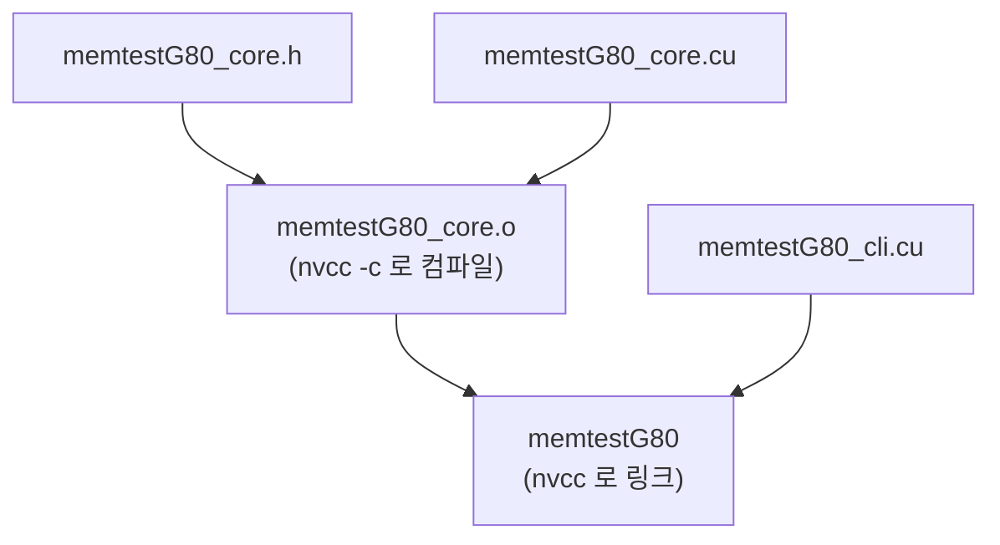
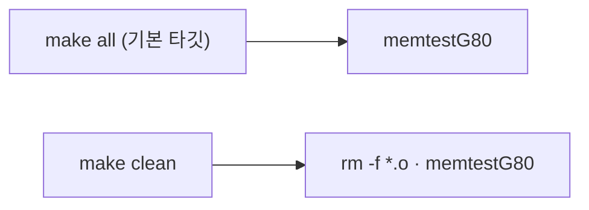

# `Makefile.osx` 빌드 분석 (한국어)

> MemtestG80을 **macOS (Mac OS X)**에서 빌드하는 GNU Make 파일입니다. 두 소스(`memtestG80_core.cu`,
> `memtestG80_cli.cu`)와 헤더(`memtestG80_core.h`)를 `nvcc`로 컴파일·링크해 실행 파일 `memtestG80`을 만듭니다.
> 이 문서는 빌드 구조를 블록 다이어그램과 함께 설명합니다.

- 원본: [`Makefile.osx`](Makefile.osx) · 저장소 루트에서 `make -f Makefiles/Makefile.osx` 로 실행
- 플랫폼: **macOS (Mac OS X)** · 산출물: `memtestG80` · 목적 파일 확장자: `.o`

---

## 1. 빌드 의존성 그래프



**핵심 흐름**: `core.cu`(+`core.h`)를 먼저 목적 파일 `memtestG80_core.o`로 컴파일한 뒤,
그 목적 파일과 `cli.cu`를 함께 `nvcc`에 넘겨 최종 실행 파일 `memtestG80`으로 링크합니다. (즉 `cli.cu`는
별도 목적 파일 없이 마지막 단계에서 컴파일·링크됩니다.)

---

## 2. 타깃(target) 구조



| 타깃 | 의존성 | 동작 |
|---|---|---|
| `all` | `memtestG80` | 기본 타깃 — 실행 파일을 빌드 |
| `memtestG80_core.o` | `memtestG80_core.cu`, `memtestG80_core.h` | `nvcc -c $(NVCCFLAGS)`로 목적 파일 생성 |
| `memtestG80` (규칙명 `memtestG80`) | `memtestG80_core.o`, `memtestG80_cli.cu` | 목적 파일 + `cli.cu`를 링크 |
| `clean` | — | 목적 파일과 실행 파일 삭제 |

---

## 3. 변수(variable)

| 변수 | 값 | 설명 |
|---|---|---|
| `NVCC` | `nvcc` | CUDA 컴파일러 드라이버 (실제 빌드에 사용) |
| `CXX` | `g++` | C++ 컴파일러 변수 (선언되지만 아래 규칙에서 사용되지 않음) |
| `CFLAGS` | `-DOSX -O -Wall` | C 플래그 변수 (선언되지만 사용되지 않음) |
| `NVCCFLAGS` | `-DOSX -O2 -Xptxas -v -Xcompiler -Wall` | nvcc에 전달되는 실제 컴파일·링크 플래그 |


> ⚠️ **관찰**: `CFLAGS`와 `CXX`는 선언되어 있으나 실제 빌드 규칙에서는 **사용되지 않습니다**. 두 `.cu`
> 파일 모두 `$(NVCC)`(nvcc)와 `$(NVCCFLAGS)`로만 컴파일되기 때문입니다. 즉 실효적인 빌드 설정은
> `NVCC`와 `NVCCFLAGS` 두 가지입니다.

---

## 4. 컴파일 플래그(`NVCCFLAGS`) 해부

`-DOSX -O2 -Xptxas -v -Xcompiler -Wall`

| 플래그 | 의미 |
|---|---|
| `-DOSX` | 플랫폼 매크로 — 소스가 OS별 코드를 선택 (core.h의 #if defined 분기) |
| `-O2` | 최적화 레벨 2 (nvcc 호스트/디바이스 코드) |
| `-Xptxas -v` | PTX 어셈블러에 상세 출력 요청 → 커널별 레지스터·공유 메모리 사용량 표시 |
| `-Xcompiler -Wall` | 호스트 컴파일러(g++)에 -Wall(모든 경고) 전달 |


> `-Xptxas -v`가 특히 유용합니다 — 커널의 레지스터/공유 메모리 사용량을 빌드 로그에 출력해, 세미나
> 세션 3(공유 메모리·리덕션)에서 점유율(occupancy)을 논의할 때 참고할 수 있습니다.

---

## 5. 사용법

```bash
# 저장소 루트에서
make -f Makefiles/Makefile.osx          # memtestG80 빌드
make -f Makefiles/Makefile.osx clean    # 목적 파일·실행 파일 정리
```

- `nvcc`가 PATH에 있어야 하고, CUDA 프로그램을 실행할 수 있는 환경이어야 합니다.
- 빌드 실패의 흔한 원인은 `nvcc`가 PATH에 없거나 CUDA 툴킷 경로가 환경에 설정되지 않은 경우입니다.

> **플랫폼 참고**: Linux판과 달리 ZLIB_DIR/CUDA_DIR 라이브러리 경로(-L)와 -m32/-m64 아키텍처 플래그가 없습니다.

---

## 6. 플랫폼별 Makefile 비교

| 항목 | linux32 | linux64 | osx | windows |
|---|---|---|---|---|
| 플랫폼 매크로 | `-DLINUX` | `-DLINUX` | `-DOSX` | `-DWINDOWS -DCURL_STATICLIB` |
| 아키텍처 | `-m32` | `-m64` | (기본) | (기본) |
| 라이브러리 경로 `-L` | zlib/linux32·lib32 | zlib/linux64·lib64 | (없음) | (없음) |
| `-Xcompiler -Wall` | ✅ | ✅ | ✅ | ❌ |
| 목적 파일 | `.o` | `.o` | `.o` | `.obj` |
| 산출물 | `memtestG80` | `memtestG80` | `memtestG80` | `memtestG80.exe` |
| `CXX` | `g++` | `g++` | `g++` | `nvcc` |

> **↳** 이 파일(`Makefile.osx`)은 위 표의 **macOS (Mac OS X)** 열에 해당합니다.

---

*이 문서는 Makefile을 1차 자료로 삼아 작성한 한국어 분석입니다. 코드가 갱신되면 값·경로를 재확인하세요.*
