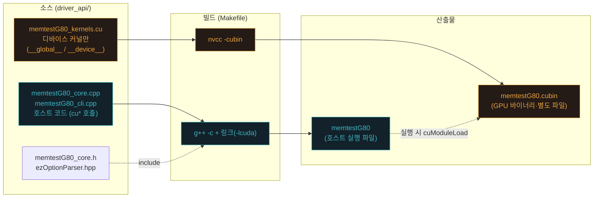
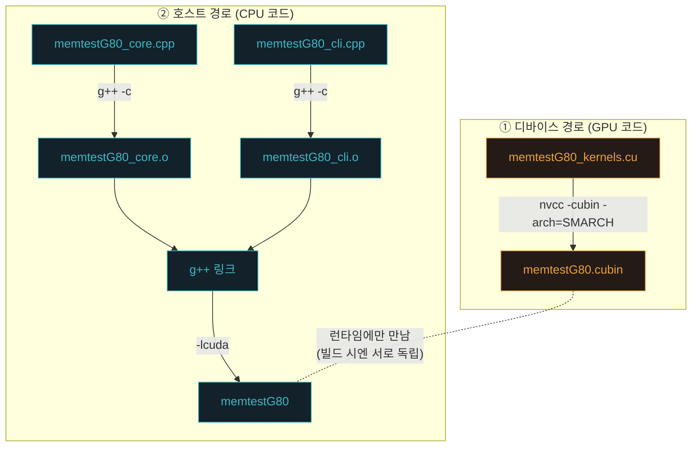
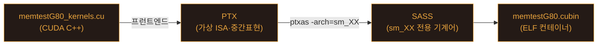
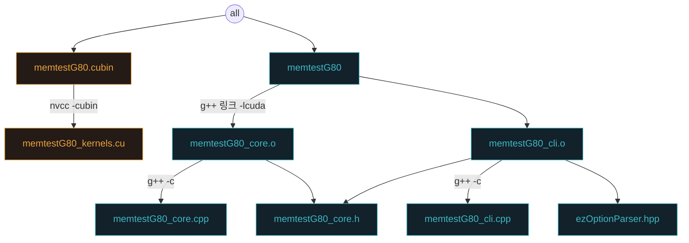
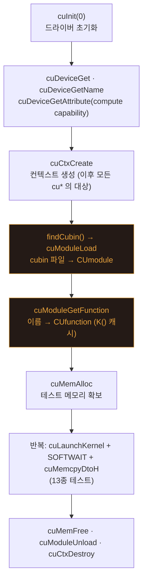
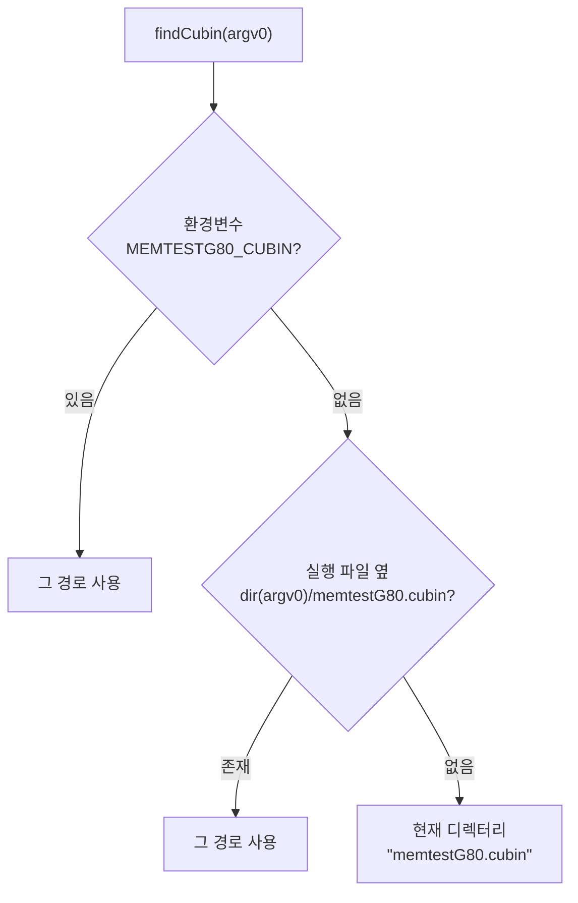
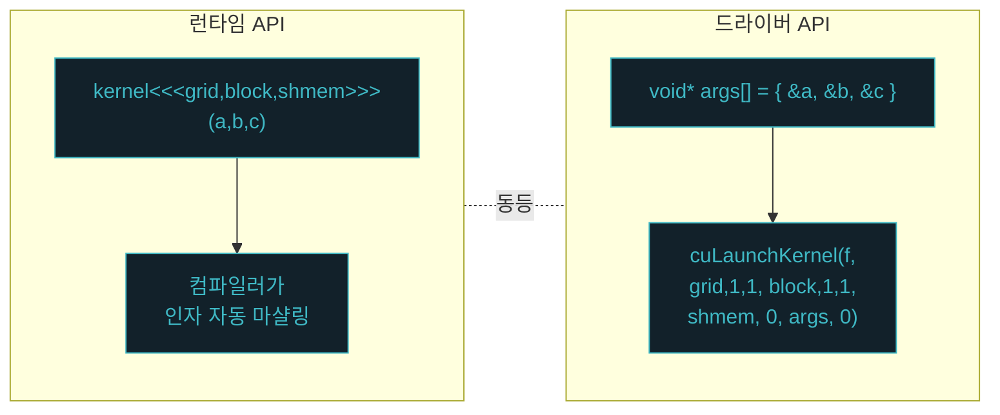
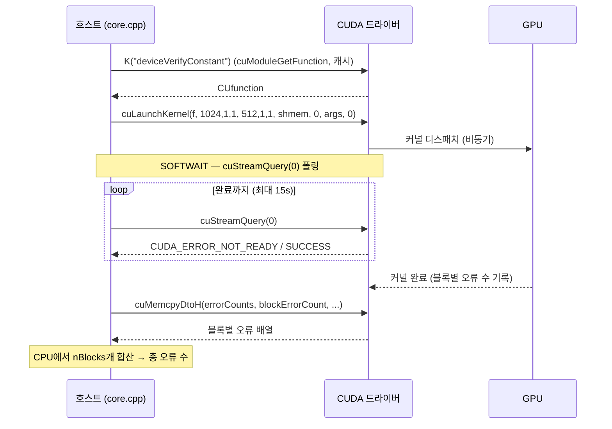

# 부록 1 — CUDA Driver API로 보는 **빌드 & 커널 로딩** (`driver_api/` 분석)

> **위치**: 본편(세션 0~5)을 마친 뒤 읽는 심화 부록입니다.
> **원본**: `driver_api/` 디렉터리 — 런타임 API로 짜인 MemtestG80을 **드라이버 API(`cu*`)** 로 다시 구현한 판.
> **이 부록이 집중하는 두 가지**: ① **빌드 과정**(호스트/디바이스 분리 컴파일, cubin) · ② **커널 로딩 과정**(cuModuleLoad → cuModuleGetFunction → cuLaunchKernel).
> **표기**: 한글 용어 옆에 원어(영어)를 병기합니다. 예) 모듈(module)

---

## 왜 이 부록인가 — 런타임 API가 "숨겨 주던" 것

본편에서 읽은 MemtestG80은 **CUDA 런타임 API**(`cudaMalloc`, `커널<<<grid,block>>>(...)`, `cudaMemcpy`)로 작성돼 있습니다. 런타임 API는 편하지만, GPU 프로그램이 실제로 어떻게 **빌드되고 로드되는지**를 컴파일러(`nvcc`)가 대신 처리해 **감춰** 줍니다.

**드라이버 API(driver API)** 는 그 감춰진 단계를 개발자가 직접 씁니다. 그래서 배우기엔 더 번거롭지만, 다음을 눈으로 볼 수 있습니다.

| 런타임 API가 자동으로 해 주던 일 | 드라이버 API에서는 직접 |
|---|---|
| 컨텍스트(context) 생성 | `cuInit` → `cuCtxCreate` |
| 커널을 실행 파일에 **내장**([fatbin](#term-fatbin)) | 커널을 **별도 `.cubin`** 으로 두고 실행 중 `cuModuleLoad` |
| 커널 이름 → 함수 핸들 연결 | `cuModuleGetFunction(module, "이름")` |
| `<<<>>>` 인자 [마샬링(marshalling)](#term-marshalling) | `void* args[]` 배열을 손으로 구성 → `cuLaunchKernel` |

이 부록은 그중에서도 **빌드 과정**(Part A)과 **커널 로딩 과정**(Part B)에 집중합니다.

---

## 0. 전체 그림 — 소스에서 실행까지

`driver_api/` 는 **디바이스 코드(커널)** 와 **호스트 코드**가 완전히 분리돼 있습니다. 이 분리가 빌드·로딩 전체를 이해하는 열쇠입니다.



> **한 줄 요약**: 커널은 `nvcc` 로 **cubin**(GPU 전용 바이너리)이 되어 따로 남고, 호스트는 `g++` 로 실행 파일이 되며, 실행 파일은 **실행 중에** cubin을 읽어 커널을 불러옵니다.

### 디렉터리 구성

| 파일 | 역할 | 컴파일러 |
|---|---|---|
| `memtestG80_kernels.cu` | **디바이스 커널만** (`__global__`/`__device__`). `extern "C"` 로 노출 | `nvcc -cubin` → `memtestG80.cubin` |
| `memtestG80_core.h` | 공개 API — `memtestState`, SOFTWAIT, 센티넬, 모듈 관리 선언 | (헤더) |
| `memtestG80_core.cpp` | 호스트 구현 — 모듈 로딩, `cuLaunchKernel`, 메모리(`cuMem*`) | `g++` |
| `memtestG80_cli.cpp` | `main()` — 디바이스 열거·컨텍스트·cubin 로드 + 13종 테스트 루프 | `g++` |
| `ezOptionParser.hpp` | 명령행 인자 파서 (자체 포함용 복사본) | (헤더) |
| `Makefile` | Linux x64 빌드 (cubin + 호스트 링크 `-lcuda`) | — |

---

# PART A — 빌드 과정 (Build) ★핵심 1

## A.1 두 갈래 컴파일 — 왜 나눠야 하나

런타임 API 원본(`memtestG80_core.cu`)은 커널과 호스트가 **한 파일**에 섞여 있어 전체를 `nvcc` 로 컴파일했습니다. `nvcc` 는 내부적으로 디바이스 코드를 뽑아 GPU 바이너리로 만들고 이를 실행 파일에 **[fatbin](#term-fatbin)**으로 끼워 넣습니다(개발자는 이 과정을 보지 못함).

드라이버 API 판은 이를 **두 갈래**로 명시적으로 쪼갭니다.



핵심은 **두 경로가 빌드 시점에는 완전히 독립**이라는 점입니다. cubin과 실행 파일은 서로를 링크하지 않습니다. 둘은 오직 **실행 시**(`cuModuleLoad`)에만 만납니다. 이것이 "런타임 커널 로딩"의 본질입니다.

## A.2 디바이스 컴파일 — `nvcc -cubin` 뜯어보기

```make
$(CUBIN): memtestG80_kernels.cu
	$(NVCC) -cubin -arch=$(SMARCH) -Xptxas -v -o $(CUBIN) memtestG80_kernels.cu
```

`nvcc -cubin` 은 `.cu` 안의 디바이스 코드를 **[SASS](#term-sass)**(특정 GPU 세대의 실제 기계어)로 컴파일해 `.cubin` 파일 하나로 내보냅니다. 그 사이의 중간표현이 **[PTX](#term-ptx)** 입니다. 내부 단계는 이렇습니다.



- **`-arch=$(SMARCH)`**: 어느 GPU 세대의 SASS를 낼지 지정. `sm_52`(Maxwell), `sm_75`(Turing/T4), `sm_86`(Ampere), `sm_89`(Ada) 등.
- **`-Xptxas -v`**: PTX 어셈블러([ptxas](#term-ptxas))에 verbose 옵션을 넘겨 **레지스터/공유 메모리 사용량**을 출력 → 커널 점유율(occupancy) 감 잡기용.
- **산출물 `memtestG80.cubin`**: 여러 커널을 담은 **ELF 형식 컨테이너**. `cuobjdump -sass memtestG80.cubin` 으로 디스어셈블해 볼 수 있습니다.

<a id="term-ptx"></a>

> **📖 용어 — PTX (Parallel Thread eXecution)**
>
> **발음**: 철자 그대로 "피-티-엑스" (P-T-X)
>
> **PTX**는 NVIDIA GPU의 **가상 ISA(중간표현)** 입니다. 특정 하드웨어에 매이지 않은 **아키텍처 독립적**인 어셈블리로, 무한한 가상 레지스터를 쓰는 등 사람이 비교적 읽기 쉬운 수준입니다. CPU 세계의 "이식 가능한 중간 코드(예: 바이트코드)"에 해당합니다.
>
> - **위치**: `CUDA C++ → (nvcc 프런트엔드) → PTX → (ptxas) → SASS` 파이프라인의 중간 단계.
> - **이식성**: 실제 기계어가 아니므로, 로드 시 드라이버가 대상 GPU에 맞는 SASS로 **JIT 컴파일**합니다 → 여러 세대 GPU에서 동작(첫 실행이 살짝 느림).
> - **도구**: `nvcc -ptx` 로 산출. `driver_api/`에서 `-cubin`을 `-ptx`로 바꾸면 이식성 있는 로딩이 됩니다(로드 코드는 동일).

<a id="term-sass"></a>

> **📖 용어 — SASS (Streaming ASSembler)**
>
> **발음**: [sæs] "쌔스" — 영어 단어 *sass* 와 동일한 한 음절 (S-A-S-S 철자로 읽지 않음)
>
> **SASS**는 특정 GPU 아키텍처(`sm_XX`)에서 하드웨어가 직접 실행하는 **실제 기계어(native ISA)** 입니다. 실제 레지스터 할당·명령 스케줄링이 반영된, PTX보다 더 저수준의 코드입니다. `cubin` 안에 담기는 것이 바로 이 SASS입니다.
>
> - **PTX와의 관계**: PTX가 "가상 중간표현"이라면 SASS는 "특정 세대 전용 진짜 기계어" — [`ptxas`](#term-ptxas)`-arch=sm_XX` 가 PTX를 SASS로 번역합니다.
> - **아키텍처 전용**: SASS는 그 `sm_XX` 세대에서만 유효 → **cubin이 특정 아키텍처 전용인 근본 이유**(그래서 `SMARCH`를 GPU에 맞춰야 함).
> - **도구**: `cuobjdump -sass <cubin>` 으로 디스어셈블해 볼 수 있습니다.
> - **풀네임 주의**: 관례적으로 **"Streaming Assembler"**(SM=Streaming Multiprocessor 계열)로 풀지만, NVIDIA가 공식 문서에서 명확히 정의하진 않아 "Shader Assembly"로 푸는 경우도 있습니다 — 실무에선 보통 그냥 **SASS**로 씁니다.

<a id="term-ptxas"></a>

> **📖 용어 — ptxas (PTX ASsembler)**
>
> **발음**: "피-티-엑스-애스" (`ptx` + `as`; `as`는 "에이에스"로도 읽음)
>
> **ptxas**는 [PTX](#term-ptx)(가상 ISA)를 특정 GPU 세대의 [SASS](#term-sass)(실제 기계어)로 번역하는 **백엔드 어셈블러 겸 최적화 컴파일러**입니다. 이름의 `as`는 유닉스 어셈블러 관례(GNU `as` 등)에서 왔지만, 실제로는 **레지스터 할당·명령 스케줄링·최적화**까지 수행해 단순 어셈블러보다는 백엔드 컴파일러에 가깝습니다.
>
> - **파이프라인 위치**: `CUDA C++ → (cicc 프런트엔드) → PTX → (ptxas) → SASS → cubin`. `nvcc -cubin -arch=sm_75` 는 내부적으로 [cicc](#term-cicc) → **ptxas** 를 호출합니다.
> - **입력/출력**: PTX → SASS. `-arch=sm_XX` 로 어느 세대 SASS를 낼지 지정.
> - **`-Xptxas`**: nvcc가 옵션을 **ptxas로 전달**하라는 뜻. 예) `-Xptxas -v` = ptxas에 verbose → 레지스터·공유 메모리 사용량 출력.
> - **JIT와의 관계**: PTX를 실행 시 드라이버가 SASS로 컴파일할 때도 사실상 ptxas 상당 기능이 동작합니다.
> - **혼동 주의**: `nvcc`(전체 드라이버) · [`cicc`](#term-cicc)(C++→PTX) · **`ptxas`(PTX→SASS)** · `fatbinary`(fatbin 묶기) · `cuobjdump`(들여다보기)는 서로 다른 단계의 도구입니다.

<a id="term-cicc"></a>

> **📖 용어 — cicc**
>
> **발음**: 표준은 없고 "씩"([sɪk], *kick* 운율) 또는 철자 그대로 "씨-아이-씨-씨"로 읽습니다.
>
> **cicc**는 CUDA 툴체인의 **디바이스 코드 프런트엔드 컴파일러** — `.cu` 안의 **CUDA C++ 디바이스 코드를 [PTX](#term-ptx)로 컴파일**합니다. `nvcc`가 디바이스 컴파일에서 가장 먼저 호출하는 단계로, 그다음 [ptxas](#term-ptxas)가 PTX→[SASS](#term-sass)로 이어받습니다.
>
> - **내부 구조**: **EDG C++ 프런트엔드**(파싱) + **NVVM**(NVIDIA의 **LLVM 기반** 최적화·코드 생성). 대략 `CUDA C++ → NVVM IR(≈LLVM IR) → 최적화 → PTX`. 즉 "디바이스 코드용 LLVM 컴파일러"로 이해하면 됩니다.
> - **호스트 코드는?**: cicc가 아니라 `cudafe++` 가 호스트/디바이스를 분리한 뒤, 호스트 몫은 g++ 같은 일반 컴파일러로 갑니다.
> - **풀네임 주의**: NVIDIA가 문서화하지 않은 **내부 도구**라 **공식 풀네임이 없습니다**(흔히 "CUDA internal C compiler"로 추측하나 비공식).

### ⚠️ cubin은 "그 아키텍처 전용"

cubin에는 특정 `sm_XX` 의 SASS만 들어 있어, **다른 세대 GPU에서는 로드가 실패**합니다(아래 Part B의 오류 표 참조). 이것이 cubin의 가장 큰 특징이자 제약입니다.

### `extern "C"` — 빌드가 만들어 낼 "이름"을 고정

```c
extern "C" {
__global__ void deviceWriteConstant(uint* base, uint N, const uint constant) { ... }
...
} // extern "C"
```

C++ 컴파일러는 오버로딩을 위해 함수 이름을 **[맹글링(name mangling)](#term-mangling)** 합니다(`deviceWriteConstant` → `_Z19deviceWriteConstant...`). 그러면 나중에 이름으로 커널을 찾을 수 없습니다. `extern "C"` 로 감싸면 맹글링이 꺼져, cubin 안에 **소스에 쓴 이름 그대로** 심볼이 남습니다. → Part B의 `cuModuleGetFunction(module, "deviceWriteConstant")` 가 성립하는 이유입니다.

<a id="term-mangling"></a>

> **📖 용어 — 이름 맹글링(name mangling)**
>
> **발음**: [ˈmæŋɡlɪŋ] "맹글링" · 우리말로는 "이름 장식/수식"으로도 옮김.
>
> **맹글링**은 C++ 컴파일러가 함수·변수 이름을 **고유한 내부 심볼 이름으로 변형(인코딩)하는 것**입니다. C++은 **오버로딩·네임스페이스·클래스 멤버·템플릿**을 지원하는데, 링커(linker)는 이름만 보고 심볼을 잇기 때문에, 같은 이름을 구별하려면 **매개변수 타입·소속 정보를 이름에 새겨** 서로 다른 심볼로 만들어야 합니다.
>
> ```
> void f(int)          →  _Z1fi
> void f(double)       →  _Z1fd
> Ns::C::f(int, char*) →  _ZN2Ns1C1fEiPc   (Itanium C++ ABI · g++/clang)
> ```
>
> - **규칙은 ABI마다 다름**: g++/clang은 Itanium C++ ABI, MSVC는 `?f@@YAXH@Z` 형식.
> - **디맹글링(demangling)**: 반대로 `_Z1fi` → `f(int)` 복원. 도구는 `c++filt`, `abi::__cxa_demangle`.
> - **`extern "C"` 와의 관계**: C는 오버로딩이 없어 맹글링을 하지 않습니다. `extern "C"`로 감싸면 맹글링이 꺼져 심볼이 **소스 이름 그대로** 남고, 그래서 `cuModuleGetFunction(m, "deviceWriteConstant")`(Part B)가 성립합니다.
> - **어원**: 동사 *mangle* = "난도질하다, 짓이겨 알아보기 어렵게 망가뜨리다"(중세 영어 `manglen` ← 고대 프랑스어 `mahaignier`, maim과 같은 뿌리). 원래 이름을 `_Z19device...`처럼 **알아보기 힘들게 뭉갠다**는 뉘앙스입니다.

## A.3 호스트 컴파일 — `nvcc` 없이 `g++` 로

```make
memtestG80_core.o: memtestG80_core.cpp memtestG80_core.h
	$(CXX) -c $(CXXFLAGS) -o memtestG80_core.o memtestG80_core.cpp
# CXXFLAGS = -O2 -Wall -m64 -I$(CUDA_INC)
```

호스트 코드에는 **디바이스 코드가 한 줄도 없습니다**(`__global__`/`<<<>>>` 없음). 필요한 건 드라이버 API 헤더 `cuda.h` 뿐입니다(`-I$(CUDA_INC)`). 그래서 평범한 `g++` 로 컴파일됩니다 — 이 판의 중요한 성질입니다. **GPU 툴체인(nvcc)은 오직 cubin을 만들 때만** 필요합니다.

## A.4 링크 — `-lcuda` (드라이버 라이브러리)

```make
$(TARGET): $(OBJS)
	$(CXX) -m64 -o $(TARGET) $(OBJS) $(LDFLAGS)
# LDFLAGS = -L$(CUDA_LIB) -L$(CUDA_STUB) -lcuda
```

여기서 링크하는 것은 **`libcuda.so`(드라이버 라이브러리)** 이지 런타임(`libcudart`)이 아닙니다. 둘의 차이:

| | `libcudart` (런타임) | `libcuda` (드라이버) |
|---|---|---|
| 제공 심볼 | `cudaMalloc`, `cudaMemcpy`, … | `cuInit`, `cuMemAlloc`, `cuLaunchKernel`, … |
| 배포 | CUDA Toolkit과 함께 | **드라이버 설치 시** 시스템에 설치 |
| 이 판에서 | 사용 안 함 | **사용** (`-lcuda`) |

- **`-L$(CUDA_STUB)`**(`.../lib64/stubs`): 빌드 머신에 실제 드라이버가 없어도 **링크만** 되도록 `libcuda.so` 스텁(stub)을 제공합니다. 실제 실행 시에는 시스템에 설치된 진짜 `libcuda.so` 가 로드됩니다.

## A.5 Makefile을 의존성 그래프로 읽기

`make` 는 아래 의존 관계를 보고 **바뀐 부분만** 다시 빌드합니다.



주요 변수(덮어쓰기 가능):

| 변수 | 기본값 | 뜻 |
|---|---|---|
| `SMARCH` | `sm_52` | cubin 대상 GPU 아키텍처. **자기 GPU에 맞게 반드시 조정** |
| `CUDA_PATH` | `/usr/local/cuda` | 툴킷 경로(`nvcc`, 헤더, `lib64`, `stubs`) |
| `NVCC` | `$(CUDA_PATH)/bin/nvcc` | 디바이스 컴파일러 |
| `CXX` | `g++` | 호스트 컴파일러 |

```bash
make SMARCH=sm_75      # Turing/T4용 cubin + 실행 파일
make clean             # *.o, 실행 파일, cubin 삭제
```

## A.6 cubin vs PTX vs fatbin — 무엇을 남길까

| 산출물 | 담긴 것 | 이식성 | 이 판의 선택 |
|---|---|---|---|
| **cubin** | 특정 `sm_XX` [SASS](#term-sass) | ❌ 그 세대 전용 | ✅ (요청대로 "cubin 로딩 구조" 시연) |
| **[PTX](#term-ptx)** | 가상 ISA | ✅ 드라이버가 실행 시 JIT | 대안 (아래) |
| **fatbin** | 여러 SASS + PTX 묶음 | ✅ 넓음 | 런타임 API 원본이 내부적으로 사용 |

> PTX로 바꾸려면 Makefile의 `-cubin` → `-ptx`, 산출물 `memtestG80.ptx` 로만 바꾸면 됩니다. **로드 코드(Part B)는 그대로** — `cuModuleLoad` 는 cubin/PTX/fatbin을 모두 같은 방식으로 받습니다(PTX면 드라이버가 로드 시 JIT 컴파일).

<a id="term-fatbin"></a>

> **📖 용어 — fatbin (fat binary)**
>
> **발음**: [ˈfætbin] "팻빈" (fat 팻 + bin 빈)
>
> **fatbin**은 같은 커널을 **여러 GPU 아키텍처용으로 컴파일한 코드를 하나로 묶어 담은 컨테이너**입니다. 이름 그대로 여러 버전을 "살찌워(fat)" 넣어 둔 바이너리입니다.
>
> - **담기는 것**: 여러 세대의 **SASS**(`sm_70`·`sm_75`·`sm_86` …)에 더해, 미지원/미래 GPU용 안전망으로 **PTX** 1벌.
> - **왜 필요한가**: `cubin`은 특정 `sm_XX` 전용이라 다른 세대 GPU에서 못 씁니다. 어떤 GPU에서 돌지 미리 알 수 없으니, 여러 버전을 함께 넣어 두고 실행 시 맞는 것을 고르게 합니다.
> - **실행 시 선택**: GPU에 맞는 SASS가 있으면 그대로 사용 → 없으면 하위호환 SASS → 그것도 없으면 담아 둔 **PTX를 드라이버가 JIT 컴파일**해 사용.
> - **이 프로젝트에서**: **런타임 API 원본**은 `nvcc`가 커널을 fatbin으로 만들어 **실행 파일에 내장**합니다(그래서 로딩 과정을 볼 일이 없음). 반면 **`driver_api/` 판**은 일부러 fatbin 내장 대신 **단일 cubin을 별도 파일**로 두고 `cuModuleLoad`로 직접 로드해 로딩 과정을 드러냅니다.
> - 요약: fatbin은 **이식성(여러 GPU 지원) ↔ 크기·단순함**의 절충입니다. `cuobjdump -all <실행파일>` 로 내부에 담긴 아키텍처 코드들을 확인할 수 있습니다.

---

# PART B — 커널 로딩 & 실행 과정 (Kernel Loading) ★핵심 2

빌드가 끝나면 실행 파일과 cubin이 따로 존재합니다. 이제 실행 파일이 **실행 중에** cubin을 불러와 커널을 돌리는 과정을 봅니다. 전체 수명주기는 다음과 같습니다.



로딩의 핵심 3단계는 **③ `cuModuleLoad` → ④ `cuModuleGetFunction` → ⑥ `cuLaunchKernel`** 입니다. 하나씩 봅니다.

## B.1 초기화 — `cuInit` → 디바이스 조회 → 컨텍스트

`memtestG80_cli.cpp:main()` 도입부:

```c
CUresult res = cuInit(0);                 // ① 드라이버 초기화 (한 번만)
cuDeviceGetCount(&devCount);              // 디바이스 개수
cuDeviceGet(&cuDev, gpuID);               // gpuID번 디바이스 핸들
cuDeviceGetName(devName, sizeof(devName), cuDev);
cuDeviceGetAttribute(&ccMajor, CU_DEVICE_ATTRIBUTE_COMPUTE_CAPABILITY_MAJOR, cuDev);
cuDeviceGetAttribute(&ccMinor, CU_DEVICE_ATTRIBUTE_COMPUTE_CAPABILITY_MINOR, cuDev);
CUcontext cuCtx;
res = cuCtxCreate(&cuCtx, 0, cuDev);      // ② 컨텍스트 생성
```

- 런타임 API에서는 이 모든 것이 첫 `cudaXxx` 호출 때 **자동**으로 일어납니다. 드라이버 API에서는 순서를 직접 맞춰야 합니다(`cuInit` → 디바이스 → 컨텍스트).
- `cuDeviceGetAttribute` 로 읽은 **compute capability**(예: `sm_75`)는 cubin의 `SMARCH` 와 맞아야 로드가 성공합니다. — 사용자가 GPU/cubin 불일치를 진단할 단서.

## B.2 cubin 찾기 — `findCubin()`

`cuModuleLoad` 는 **파일 경로**를 받으므로, 실행 파일이 cubin의 위치를 알아야 합니다. 탐색 우선순위:



```c
const char* env = getenv("MEMTESTG80_CUBIN");   // ① 환경변수 우선
if (env && *env) return std::string(env);
// ② 실행 파일이 있는 폴더 옆
std::string cand = dir(argv0) + "/memtestG80.cubin";
if (fopen(cand.c_str(),"rb")) return cand;
return std::string("memtestG80.cubin");          // ③ 현재 디렉터리
```

## B.3 로드 — `cuModuleLoad` (cubin → 모듈)

`memtestG80_core.cpp`:

```c
static CUmodule g_module = 0;

bool memtestG80_initKernels(const char* cubinPath) {
    if (cuModuleLoad(&g_module, cubinPath) != CUDA_SUCCESS) {  // 파일 → CUmodule
        g_module = 0;
        return false;
    }
    return true;
}
```

`cuModuleLoad` 는 cubin(또는 PTX/fatbin) 파일을 읽어 현재 컨텍스트에 **모듈(module)** 로 올립니다. 반환된 `CUmodule` 핸들이 이후 커널 조회의 대상입니다. (파일이 없거나 아키텍처가 안 맞으면 여기서 실패 → CLI가 친절한 오류를 출력.)

## B.4 심볼 해석 — `cuModuleGetFunction` + 캐싱

```c
static std::map<std::string, CUfunction> g_funcs;   // 이름→핸들 캐시

static CUfunction K(const char* name) {
    auto it = g_funcs.find(name);
    if (it != g_funcs.end()) return it->second;      // 이미 찾았으면 재사용
    CUfunction f = 0;
    if (cuModuleGetFunction(&f, g_module, name) != CUDA_SUCCESS) return 0;
    g_funcs[name] = f;                               // 캐시에 저장
    return f;
}
```

- `cuModuleGetFunction(&f, module, "deviceWriteConstant")` 는 모듈 안에서 **그 이름의 커널**을 찾아 `CUfunction` 핸들을 돌려줍니다.
- 이름이 그대로 통하는 건 A.2의 **`extern "C"`** 덕분입니다.
- **`K()` 헬퍼**는 조회 결과를 `map` 에 캐시해, 같은 커널을 반복 실행할 때 매번 심볼을 다시 찾지 않게 합니다(13종 테스트를 수십 번 반복하므로 효과적).

cubin에 노출된 12개 커널(모두 `cuModuleGetFunction` 이름 매칭 대상):

```
deviceWriteConstant        deviceVerifyConstant
deviceShortLCG0            deviceShortLCG0Shmem
deviceWritePairedConstants deviceVerifyPairedConstants
deviceWriteWalking32Bit    deviceVerifyWalking32Bit
deviceWriteRandomBlocks    deviceVerifyRandomBlocks
deviceWritePairedModulo    deviceVerifyPairedModulo
```

## B.5 실행 — `cuLaunchKernel` (인자 [마샬링](#term-marshalling))

런타임 API의 `<<<grid,block,shmem>>>(a,b,c)` 를 드라이버 API로 풀어 쓴 것이 이 판의 `launch()` 헬퍼입니다.

```c
static CUresult launch(CUfunction f, uint grid, uint block, uint shmem, void** args) {
    if (!f) return CUDA_ERROR_NOT_FOUND;
    return cuLaunchKernel(f,
                          grid, 1, 1,   // gridDim.{x,y,z}
                          block, 1, 1,  // blockDim.{x,y,z}
                          shmem,        // 동적 공유 메모리 바이트
                          0,            // 스트림(기본)
                          args,         // 커널 인자 포인터 배열
                          0);           // extra
}
```

**가장 큰 차이는 인자 전달**입니다. `<<<>>>` 는 컴파일러가 인자를 자동으로 포장하지만, 드라이버 API는 **각 인자의 주소를 담은 `void*` 배열**을 직접 만듭니다.

```c
// 런타임 API (원본)
deviceVerifyConstant<<<nBlocks, nThreads, sizeof(uint)*nThreads>>>(base, N, constant, blockErrorCount);

// 드라이버 API (이 판)  — 각 인자의 "주소"를 배열로
void* args[] = { &base, &N, &constant, &blockErrorCount };
launch(K("deviceVerifyConstant"), nBlocks, nThreads, sizeof(uint)*nThreads, args);
```



> **주의**: `args[]` 에는 값이 아니라 **주소**가 들어갑니다. 그래서 임시값도 lvalue여야 합니다 — `gpuModuloX` 가 `pattern2` 같은 지역 변수를 따로 두는 이유입니다. `shmem`(동적 공유 메모리 바이트 수)은 검증 커널의 `threadErrorCount[]` 리덕션 버퍼 크기(`sizeof(uint)*nThreads`)로 넘어갑니다.

<a id="term-marshalling"></a>

> **📖 용어 — 마샬링(marshalling)**
>
> **발음**: [ˈmɑːrʃəlɪŋ] "마-셜링" (marshal 마셜 + -ing)
>
> **마샬링**은 데이터를 한 실행 환경에서 다른 실행 환경으로 넘길 수 있도록, 양쪽이 약속한 형식으로 **인자들을 포장(직렬화)하는 작업**입니다. 반대로 받은 쪽이 다시 풀어내는 것은 **언마샬링(unmarshalling)**이라고 합니다. (함수 호출의 인자→스택/레지스터 배치, RPC·IPC의 데이터 전송, JSON/Protobuf 직렬화 등이 모두 마샬링의 예입니다.)
>
> - **여기서의 의미**: 호스트가 GPU 커널에 넘길 인자들을, 드라이버가 이해하는 형식으로 포장하는 것.
> - **런타임 API** `<<<>>>` 는 이 포장을 **컴파일러가 자동**으로 처리합니다 — `deviceVerifyConstant<<<...>>>(base, N, constant, errCnt)`.
> - **드라이버 API** `cuLaunchKernel` 은 **개발자가 직접** 합니다 — 각 인자의 **주소를 담은 `void* args[]` 배열**을 만들어 넘기고, 드라이버는 이 배열을 순서대로 읽어 GPU의 커널 인자 영역에 배치합니다.
> - 우리말로는 "직렬화" 또는 "정돈해서 전달"로 옮기지만, 시스템 프로그래밍에서는 보통 원어 그대로 **마샬링**이라고 씁니다.
>
> **어원** — `marshal`은 고대 프랑크어 **`marhskalk`**(`marh` 말 + `skalk` 하인 = "마부")에서 왔습니다. 이후 왕의 기병을 관리하는 고위직 → **원수(Field Marshal)·의전관**으로 격상되었고, 여기서 동사 **to marshal**("병력·자원을 질서 있게 정렬·편성하다")이 나왔습니다(예: `marshalling yard` = 철도 조차장, 화차를 목적지별로 줄 세워 편성하는 곳). 이 **"정해진 순서로 줄 세워 편성한다"**는 이미지가 전산 용어로 넘어와, 인자·데이터를 약속된 형식으로 정렬·포장하는 작업을 뜻하게 되었습니다. `void* args[]` 배열을 순서대로 채워 커널에 넘기는 것이 바로 그 "정렬·편성"에 해당합니다. (표기는 마셜링/마샬링, 철자는 영국식 `marshalling`·미국식 `marshaling`이 함께 쓰입니다.)

## B.6 완료 대기 — `SOFTWAIT` = `cuStreamQuery` 폴링

커널 런치는 **비동기**라 곧바로 반환됩니다. 결과를 CPU로 복사하기 전에 완료를 기다려야 합니다. 이 판은 바쁜 대기 대신 **슬립 폴링(sleep-poll)** 을 씁니다(`memtestG80_core.h`).

```c
inline int _pollStatus(unsigned length=1, unsigned limit=15000) {
    unsigned startTime = getTimeMilliseconds();
    while (cuStreamQuery(0) == CUDA_ERROR_NOT_READY) {   // 아직 실행 중?
        if ((getTimeMilliseconds() - startTime) > limit) return -1;  // 타임아웃
        SLEEPMS(length);                                 // 잠깐 자고 다시 확인
    }
    return 0;
}
#define SOFTWAIT() if (_pollStatus() != 0) { return MEMTEST_TIMEOUT; }
```

- `cuStreamQuery(0)` 가 `CUDA_ERROR_NOT_READY` 를 돌려주는 동안 1ms씩 자며 대기 → CPU를 100% 태우지 않음.
- 15초를 넘기면 **타임아웃 센티넬**(`MEMTEST_TIMEOUT = 0xFFFFFFFE`)을 반환. 런치 실패는 `MEMTEST_LAUNCH_FAILED = 0xFFFFFFFF`. (원본과 동일한 관례.)

## B.7 한 번의 테스트 호출 — 호스트↔드라이버↔GPU 시퀀스

`gpuVerifyConstant` 한 번이 실제로 밟는 경로:



이 시퀀스가 13종 테스트마다 반복되고, 그 전체가 `maxIters` 번 반복됩니다(`memtestG80_cli.cpp` 의 메인 루프).

## B.8 정리 — 자원 해제

```c
tester.deallocate();          // cuMemFree
memtestG80_unloadKernels();   // cuModuleUnload → g_module=0, 캐시 clear
cuCtxDestroy(cuCtx);          // 컨텍스트 파괴
```

로드했던 것을 역순으로 해제합니다. `memtestState` 는 소멸자에서 `deallocate()` 를 부르는 **RAII**(자원 획득이 곧 초기화) 패턴이라, 메모리 해제는 예외/조기 반환에도 안전합니다.

---

## PART C — 런타임 API ↔ 드라이버 API 대응표

| 작업 | 런타임 API (원본) | 드라이버 API (이 판) |
|---|---|---|
| 초기화 | (자동) | `cuInit`, `cuCtxCreate` |
| 디바이스 열거 | `cudaGetDeviceCount` / `cudaGetDeviceProperties` | `cuDeviceGetCount` / `cuDeviceGetName` / `cuDeviceGetAttribute` |
| **커널 로딩** | (실행 파일에 [fatbin](#term-fatbin) 내장) | **`cuModuleLoad(cubin)` → `cuModuleGetFunction`** |
| **커널 실행** | `kernel<<<grid,block,shmem>>>(args)` | **`cuLaunchKernel(func, grid,1,1, block,1,1, shmem, 0, args, 0)`** |
| 메모리 할당 | `cudaMalloc` / `cudaFree` | `cuMemAlloc` / `cuMemFree` |
| 메모리 복사 | `cudaMemcpy(...,DtoH/DtoD)` | `cuMemcpyDtoH` / `cuMemcpyDtoD` |
| 완료 대기 | `cudaStreamQuery(0)` | `cuStreamQuery(0)` |
| 동기화 | `cudaThreadSynchronize` | `cuCtxSynchronize` |
| 디바이스 포인터 | `uint*` | `CUdeviceptr` (바이트 주소) |
| 링크 라이브러리 | `-lcudart` | **`-lcuda`** |

---

## PART D — 직접 해보기 (Hands-on)

> GPU와 CUDA 툴킷이 있는 리눅스 x64 환경 기준. 없다면 각 실습의 "관찰 포인트"만 읽어도 흐름을 이해할 수 있습니다.

### Exercise 1 — 빌드하고 cubin 안을 들여다보기
```bash
cd driver_api
make SMARCH=sm_75              # 자기 GPU 아키텍처로
ls -l memtestG80 memtestG80.cubin   # 실행 파일과 cubin이 "따로" 생김
cuobjdump -symbols memtestG80.cubin | grep device   # extern "C" 이름들이 그대로 보임
cuobjdump -sass memtestG80.cubin | head             # SASS 디스어셈블
```
**관찰**: cubin은 실행 파일과 **별도 파일**이다. 심볼 이름이 [맹글링](#term-mangling)되지 않았다.

### Exercise 2 — 아키텍처 불일치로 로드 실패 재현
```bash
make clean && make SMARCH=sm_30   # 일부러 안 맞는 (구/타 세대) 아키텍처
./memtestG80 64 1                 # cuModuleLoad 실패 → 친절한 오류 메시지
```
**관찰**: cubin은 그 세대 전용이라, GPU와 안 맞으면 **로드 단계**에서 걸린다(빌드는 성공하는데 실행이 실패). → cubin의 이식성 한계.

### Exercise 3 — `MEMTESTG80_CUBIN` 으로 경로 바꾸기
```bash
mv memtestG80.cubin /tmp/k.cubin
./memtestG80 64 1                       # 이제 못 찾음 (또는 cwd 탐색 실패)
MEMTESTG80_CUBIN=/tmp/k.cubin ./memtestG80 64 1   # 환경변수로 지정 → 로드 성공
```
**관찰**: `findCubin()` 의 탐색 우선순위(환경변수 → 실행 파일 옆 → cwd)를 눈으로 확인.

### Exercise 4 — cubin 대신 PTX로 바꾸기
Makefile에서 `-cubin` → `-ptx`, `CUBIN = memtestG80.ptx` 로 바꾸고 재빌드.
```bash
# 로드 코드(cuModuleLoad)는 그대로 — findCubin/파일명만 ptx로 맞추면 됨
```
**관찰**: PTX는 드라이버가 실행 시 JIT 컴파일하므로 **다른 세대 GPU에서도** 로드된다(첫 실행이 살짝 느림). cubin↔PTX 이식성 트레이드오프 체감.

### Exercise 5 — 커널을 하나 추가해 이름으로 로드해 보기
`memtestG80_kernels.cu` 의 `extern "C" { … }` 안에 간단한 커널을 추가하고, 호스트에서 `K("myKernel")` 로 조회·실행.
**관찰**: `extern "C"` 를 빼면 `cuModuleGetFunction` 이 이름을 못 찾는다([맹글링](#term-mangling) 확인) → A.2의 이유를 몸으로 이해.

---

## 부록 — 자주 겪는 오류

| 증상 | 원인 | 해결 |
|---|---|---|
| `cuModuleLoad` 실패 / `failed to load kernel module` | cubin 아키텍처(`SMARCH`)가 GPU와 불일치 | GPU의 compute capability 확인 후 `make SMARCH=sm_XX` 재빌드 (또는 PTX 사용) |
| cubin을 못 찾음 | 실행 파일과 다른 폴더에서 실행 | `MEMTESTG80_CUBIN` 지정 또는 실행 파일 옆에 cubin 배치 |
| 링크 시 `undefined reference to cu...` | `-lcuda` 누락 | `LDFLAGS` 에 `-lcuda` 확인 |
| 링크 시 `cannot find -lcuda` | `libcuda.so` 경로 없음 | `-L$(CUDA_STUB)`(stubs) 추가 확인 |
| `cuLaunchKernel` 인자 오류/크래시 | `args[]` 에 값이 아닌 **주소**를 넣어야 함 | 각 인자를 lvalue로 두고 `&` 로 주소 전달 |
| 타임아웃 센티넬(`0xFFFFFFFE`) | 커널이 15초 초과(과도한 크기/워치독) | 테스트 크기 축소, 디스플레이 GPU면 워치독 유의 |

---

## 한눈 요약

- **빌드**: 커널 `.cu` → `nvcc -cubin` → **별도 cubin**, 호스트 `.cpp` → `g++` → **실행 파일**(`-lcuda`). 둘은 빌드 시 독립.
- **로딩**: 실행 중 `cuModuleLoad`(파일→모듈) → `cuModuleGetFunction`(이름→함수, `extern "C"` 덕분) → `cuLaunchKernel`(`void* args[]` 로 인자 전달).
- **대기/정리**: `SOFTWAIT`(=`cuStreamQuery` 폴링) → `cuMemcpyDtoH` → 합산; 끝나면 `cuMemFree`/`cuModuleUnload`/`cuCtxDestroy`.
- 런타임 API가 자동으로 해 주던 초기화·커널 내장·인자 [마샬링](#term-marshalling)을, 드라이버 API에서는 **개발자가 명시적으로** 수행한다 — 그래서 "커널이 어떻게 로드되는가"를 눈으로 배울 수 있다.

## 참고
- 원본 소스: `driver_api/` (README: `driver_api/README.md`)
- 런타임 API 원본과 비교: 본편 세션 1(커널 실행)·세션 5(3계층 API)
- NVIDIA CUDA Driver API 공식 문서 (`cuModuleLoad`, `cuLaunchKernel`)
