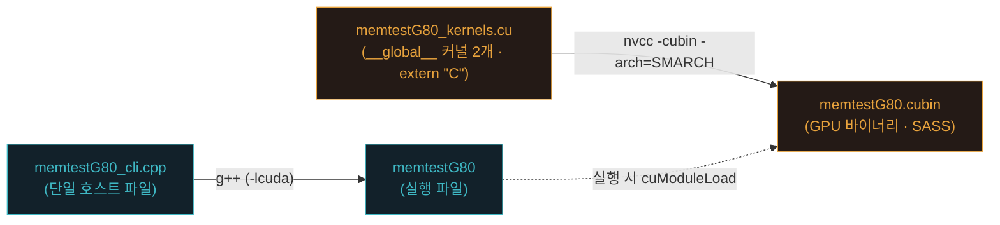
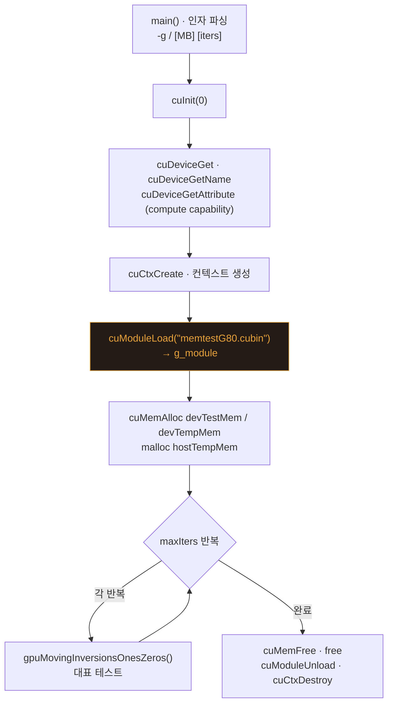
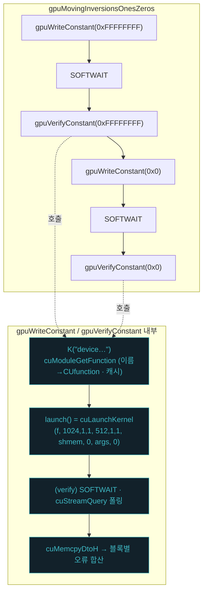

# 부록 2 — `driver_api_study`: CUDA Driver API **최소 예제** 만들기 (무엇을 덜어낼 수 있나)

> **위치**: [부록 1](부록1_DriverAPI_빌드와_커널로딩.md)에 이어 읽는 심화 부록입니다.
> **원본**: [`driver_api_study/`](../../driver_api_study/) 디렉터리 — [`driver_api/`](../../driver_api/)(Driver API 판)에서 **CUDA와 직접 관련 없는 코드를 걷어내** 커널 로딩·실행의 뼈대만 남긴 교육용 축소판.
> **이 부록이 답하는 질문**: "MemtestG80에서 **무엇을 덜어내면** CUDA Driver API로 커널을 로드·실행하는 최소 골격이 드러나는가?"
> **표기**: 한글 용어 옆에 원어(영어)를 병기합니다. 예) 모듈(module)

---

## 왜 이 부록인가

부록 1은 런타임 API로 짜인 MemtestG80을 **드라이버 API로 포팅**해 빌드·커널 로딩 과정을 드러냈습니다. 하지만 `driver_api/`는 여전히 실제 도구라서, 13종 테스트·서드파티 인자 파서·대역폭 측정·PRNG 커널 등 **학습 본질(커널 로딩·실행)과 무관한 코드**가 많습니다.

부록 2는 그것들을 **단계적으로 제거**해, 결국 다음만 남긴 과정을 기록합니다.

- 커널 **2개**(쓰기 1 + 검증 1)
- 호스트 **1파일**(초기화 → cubin 로드 → 실행 → 정리)

> 핵심 학습 포인트: **"덜어내면서 무엇이 필수였는지 배운다."** 남은 코드가 곧 Driver API로 GPU 커널을 돌리는 데 반드시 필요한 최소 집합입니다.

---

## 1. 간결화 단계 (`driver_api/` → `driver_api_study/`)

| 단계 | 덜어낸 것 | 이유 (CUDA 본질과의 관계) |
|---|---|---|
| 1 | **`ezOptionParser.hpp`** (서드파티 인자 파서) | CLI 편의 기능일 뿐, CUDA와 무관 → 표준 C++ 인자 파싱으로 대체 |
| 2 | **라이선스 출력** (`-l/--license`, `print_licensing`) | 부가 기능 |
| 3 | **대역폭 측정** (D2D 복사 + `gpuMemoryBandwidth`) | 커널 로딩·실행과 별개인 성능 측정 |
| 4 | **13종 테스트 → 1종** (Moving Inversions ones/zeros) | 대표 1종이 쓰기+검증 커널을 모두 사용 → 흐름 학습에 충분 |
| 5 | **미사용 커널·함수** (LCG·워킹·랜덤·모듈로 커널, PRNG 헬퍼, 나머지 `gpuXxx`) | 남긴 테스트가 안 쓰는 코드 |
| 6 | **배너·경로탐색 단순화 + `core.{h,cpp}` 병합** | OO 래퍼(`memtestState`)·다중 파일 구조 제거 → **단일 호스트 파일** |

**결과 (소스 규모)**

| | `driver_api/` | `driver_api_study/` |
|---|---|---|
| 커널 (`*.cu`) | 295줄 | **59줄** |
| 호스트 (`*.h`+`*.cpp`) | 118 + 378 + 258 = 754줄 | **234줄** (단일 `cli.cpp`) |
| 서드파티 (`ezOptionParser.hpp`) | ~2,100줄 | **없음** |
| **호스트+커널 코드 합계** | **1,049줄** (+ 서드파티 ~2,100줄) | **293줄** |

---

## 2. 최종 구조

```
driver_api_study/
├── memtestG80_kernels.cu   # 디바이스 커널 2개 → cubin
├── memtestG80_cli.cpp      # 호스트 전부 (단일 파일)
├── Makefile
└── README.md
```

| 파일 | 역할 |
|---|---|
| `memtestG80_kernels.cu` | `deviceWriteConstant`(쓰기) · `deviceVerifyConstant`(검증·공유 메모리 리덕션), 둘 다 `extern "C"` |
| `memtestG80_cli.cpp` | 인자 파싱 + 디바이스/컨텍스트 + cubin 로드 + 모듈 관리(`K`/`launch`) + 대표 테스트 + 정리 |
| `Makefile` | cubin(nvcc) + 호스트 단일 파일(g++ `-lcuda`) |

---

## 3. 빌드 파이프라인 (block diagram)

디바이스 커널과 호스트는 **빌드 시점엔 독립**입니다. cubin과 실행 파일은 서로 링크하지 않고, **실행 중** `cuModuleLoad` 로만 만납니다.



`driver_api/`는 호스트 오브젝트가 여러 개(core + cli + ezOptionParser 헤더)였지만, 여기서는 **호스트 컴파일 단위가 `memtestG80_cli.cpp` 하나**입니다.

---

## 4. 실행 흐름 (block diagram)

`memtestG80_cli.cpp` 의 `main()` 이 위→아래로 밟는 Driver API 수명주기:



대표 테스트가 커널을 부르는 부분(로딩·실행의 핵심)을 확대하면:



**cuModuleLoad**(cubin→모듈) → **cuModuleGetFunction**(이름→함수, `K()` 캐시) → **cuLaunchKernel** 이 로딩·실행의 3핵심입니다. (자세한 개념은 [부록 1](부록1_DriverAPI_빌드와_커널로딩.md) 참조.)

---

## 5. 무엇을 남기고 무엇을 덜어냈나

| 구분 | 남긴 것 (Driver API 필수 골격) | 덜어낸 것 (부가·중복) |
|---|---|---|
| 초기화 | `cuInit` · `cuDeviceGet*` · `cuCtxCreate` | — |
| 로딩 | `cuModuleLoad` · `cuModuleGetFunction`(`K` 캐시) | 실행 파일 옆 탐색(`fopen` 탐침), 3단계 `findCubin` |
| 실행 | `cuLaunchKernel`(`launch` 래퍼) · `SOFTWAIT` | — |
| 결과 | `cuMemcpyDtoH` + 블록별 합산 | — |
| 커널 | `deviceWriteConstant` · `deviceVerifyConstant` | LCG·워킹·랜덤·모듈로 커널, PRNG `__device__` 헬퍼 |
| 테스트 | Moving Inversions (ones/zeros) 1종 | 나머지 12종 |
| 인자 | 표준 C++ 파싱(`-g`, `[MB] [iters]`) | `ezOptionParser.hpp` |
| 구조 | 단일 `cli.cpp` | `memtestState` OO 래퍼, `core.{h,cpp}` 분리 |
| 기타 | — | 라이선스 출력, 대역폭 측정 |

> 남은 것이 곧 **"드라이버 API로 GPU 커널 하나를 돌리는 최소 집합"** 입니다.

---

## 6. 직접 해보기

```bash
cd driver_api_study
make SMARCH=sm_75        # cubin(nvcc) + 단일 호스트 파일(g++ -lcuda)
./memtestG80 128 50      # 128MB, 50회

# driver_api/ 와 무엇이 달라졌는지 비교
diff <(ls ../driver_api) <(ls ../driver_api_study)     # 파일 구성 차이
wc -l ../driver_api/*.c* ../driver_api/*.h             # 원본 규모
wc -l memtestG80_kernels.cu memtestG80_cli.cpp         # 축소판 규모
```

**관찰 포인트**
- 호스트가 **파일 하나**로 줄었지만 실행 결과(테스트 동작)는 동일하다.
- `cuModuleLoad → cuModuleGetFunction → cuLaunchKernel` 3단계는 아무리 덜어내도 **남는다** = Driver API의 필수 골격.
- cubin은 여전히 별도 파일 → `SMARCH` 를 GPU에 맞춰야 로드 성공(부록 1의 cubin 아키텍처 전용 특성).

---

## 참고
- 원본 소스: [`driver_api_study/`](../../driver_api_study/) (README에 단계별 변경·다이어그램 포함)
- 개념 심화: [부록 1](부록1_DriverAPI_빌드와_커널로딩.md) — 빌드·커널 로딩 원리, 용어 노트(마샬링·cubin·PTX·SASS·ptxas·cicc·맹글링·cuobjdump)
- 대조군: [`driver_api/`](../../driver_api/) — 축소 전 전체 기능 판
