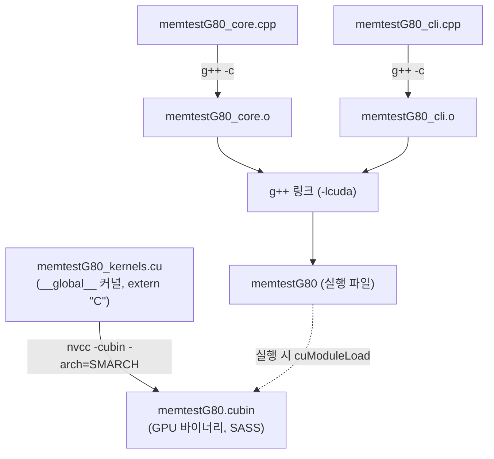
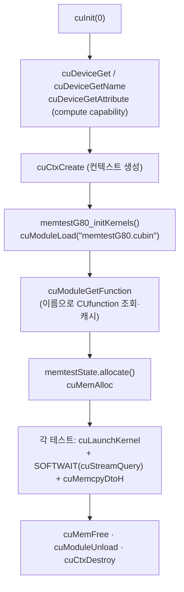

# MemtestG80 — CUDA Driver API 판 (`driver_api/`)

원본 MemtestG80은 **CUDA 런타임 API**(`cudaMalloc`, `<<<>>>` 커널 런치, `cudaMemcpy`)로 구현되어 있습니다.
이 디렉터리는 동일한 기능을 **CUDA 드라이버 API**(`cu*`)로 다시 구현해, **커널 로딩(module loading)** 과
**명시적 커널 실행(explicit launch)** 이 실제로 어떻게 이뤄지는지 학습할 수 있게 한 것입니다.

핵심 차이: 커널을 실행 파일에 정적으로 심는 대신, **디바이스 코드를 `.cubin` 으로 따로 컴파일**하고
프로그램이 실행 중에 `cuModuleLoad` 로 로드한 뒤 `cuModuleGetFunction` → `cuLaunchKernel` 로 호출합니다.

- 대상: **Linux x86-64 전용** · 단일 GPU
- 라이선스: LGPL v3 (원본과 동일)

---

## 1. 디렉터리 구성

| 파일 | 역할 | 컴파일러 |
|---|---|---|
| `memtestG80_kernels.cu` | **디바이스 커널만** (`__global__`/`__device__`). `extern "C"` 로 노출 | `nvcc -cubin` → `memtestG80.cubin` |
| `memtestG80_core.h` | 공개 API — `memtestState`, SOFTWAIT(`cuStreamQuery`), 센티넬, 모듈 관리 | (헤더) |
| `memtestG80_core.cpp` | 호스트 구현 — 모듈 로딩, `cuLaunchKernel` 실행, 메모리(`cuMem*`) | `g++` |
| `memtestG80_cli.cpp` | `main()` — 드라이버 API 디바이스 열거·컨텍스트·cubin 로드 + 13종 테스트 | `g++` |
| `ezOptionParser.hpp` | 명령행 인자 파서 (원본과 동일, 자체 포함용 복사본) | (헤더) |
| `Makefile` | Linux x64 빌드 (cubin + 호스트 링크 `-lcuda`) | — |

> **호스트/디바이스 분리**: 원본은 `memtestG80_core.cu` 하나에 커널과 호스트가 섞여 있었지만, 여기서는
> 커널(`.cu` → `.cubin`)과 호스트(`.cpp`)가 완전히 분리됩니다. 그래서 호스트 코드는 `nvcc` 없이 `g++`로만
> 컴파일되고, GPU 코드는 별도 바이너리(cubin)로 남습니다.

---

## 2. 빌드 & 실행

```bash
cd driver_api
make SMARCH=sm_75        # 대상 GPU 아키텍처 지정 (예: T4=75, Ampere=86, Ada=89)
./memtestG80 128 50      # 128MB, 50회 (원본과 동일한 CLI)
./memtestG80 --gpu 0 256 100
```

- `make` 는 ① `memtestG80.cubin` 생성 ② 호스트 `.cpp` 컴파일 ③ `-lcuda`(드라이버) 링크를 수행합니다.
- 실행 파일은 실행 시 같은 폴더의 `memtestG80.cubin` 을 로드합니다(환경변수 `MEMTESTG80_CUBIN` 로 경로 지정 가능).
- ⚠️ **cubin 은 특정 SASS 아키텍처 전용**입니다. GPU와 `SMARCH` 가 맞지 않으면 로드가 실패합니다.

---

## 3. 빌드 파이프라인 (block diagram)



원본(런타임 API)은 `nvcc` 가 커널을 실행 파일에 **fatbin 으로 내장**했지만, 여기서는 cubin 이 **별도 파일**로
남아 런타임에 로드됩니다.

---

## 4. 런타임 실행 흐름 (block diagram)



핵심은 **③ cuModuleLoad → ④ cuModuleGetFunction → ⑥ cuLaunchKernel** 3단계입니다. 런타임 API에서는
컴파일러가 숨겨 주던 이 과정을 드라이버 API에서는 개발자가 직접 수행합니다.

---

## 5. 런타임 API ↔ 드라이버 API 대응표

| 작업 | 런타임 API (원본) | 드라이버 API (이 판) |
|---|---|---|
| 초기화 | (자동) | `cuInit`, `cuCtxCreate` |
| 디바이스 열거 | `cudaGetDeviceCount` / `cudaGetDeviceProperties` | `cuDeviceGetCount` / `cuDeviceGetName` / `cuDeviceGetAttribute` |
| 커널 로딩 | (실행 파일에 내장) | `cuModuleLoad(cubin)` → `cuModuleGetFunction` |
| 커널 실행 | `kernel<<<grid,block,shmem>>>(args)` | `cuLaunchKernel(func, grid,1,1, block,1,1, shmem, 0, args, 0)` |
| 메모리 할당 | `cudaMalloc` / `cudaFree` | `cuMemAlloc` / `cuMemFree` |
| 메모리 복사 | `cudaMemcpy(...,DtoH/DtoD)` | `cuMemcpyDtoH` / `cuMemcpyDtoD` |
| 완료 대기 | `cudaStreamQuery(0)` (SOFTWAIT) | `cuStreamQuery(0)` (SOFTWAIT) |
| 동기화 | `cudaThreadSynchronize` | `cuCtxSynchronize` |
| 포인터 타입 | `uint*` (디바이스) | `CUdeviceptr` (바이트 주소) |

### 커널 실행 인자 전달의 차이

런타임 API의 `<<<>>>` 는 인자를 컴파일러가 자동으로 마샬링하지만, 드라이버 API는 **각 인자의 주소를 담은
`void*` 배열**을 직접 만들어 넘깁니다.

```c
// 런타임 API
deviceVerifyConstant<<<nBlocks, nThreads, sizeof(uint)*nThreads>>>(base, N, constant, blockErrorCount);

// 드라이버 API
void* args[] = { &base, &N, &constant, &blockErrorCount };   // 각 인자의 "주소"
cuLaunchKernel(K("deviceVerifyConstant"),
               nBlocks,1,1,  nThreads,1,1,
               sizeof(uint)*nThreads, 0, args, 0);
```

`extern "C"` 로 커널 이름 맹글링을 없앴기에 `cuModuleGetFunction(&f, module, "deviceVerifyConstant")` 처럼
소스의 이름 그대로 커널을 찾을 수 있습니다.

---

## 6. 참고 · 원본과의 차이

- **cpuWriteConstant/cpuVerifyConstant 생략**: 원본의 CPU 참조 구현은 런타임의 `dim3` 에 의존해 CLI가 쓰지도
  않으므로 이 판에서는 제외했습니다.
- **오류 처리**: 드라이버 호출은 `CUresult` 를 즉시 반환하므로 `CU_CHECK_RET` 로 검사하고, 원본과 동일한
  센티넬(`0xFFFFFFFF`=런치 실패, `0xFFFFFFFE`=타임아웃)을 유지합니다.
- **테스트 알고리즘·병렬 리덕션·PRNG 로직은 원본과 동일**합니다. 바뀐 것은 "호스트가 GPU를 부리는 방식"뿐입니다.
- 이 디렉터리는 **교육용 예제**입니다. 원본 런타임 API 빌드(`Makefiles/Makefile.linux64`)와 함께 두고
  두 방식을 비교하며 학습하도록 의도했습니다.

> cubin 대신 **PTX** 를 로드하면(드라이버가 JIT 컴파일) 아키텍처 호환성이 좋아집니다. 다만 본 예제는 요청대로
> **cubin 컴파일·로딩 구조**를 보여줍니다. PTX로 바꾸려면 Makefile 의 `-cubin` 을 `-ptx` 로, 산출물을
> `memtestG80.ptx` 로 바꾸면 됩니다(로드 코드는 동일).
