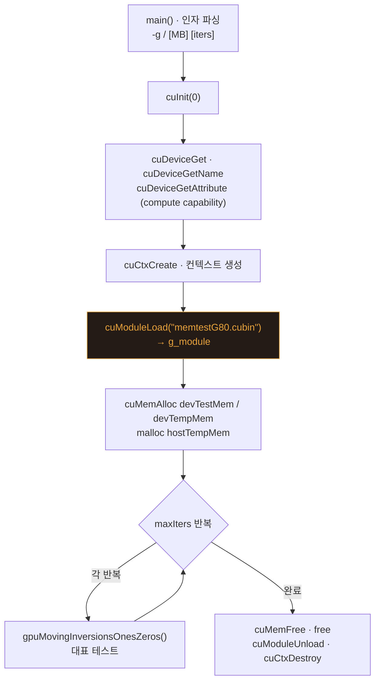
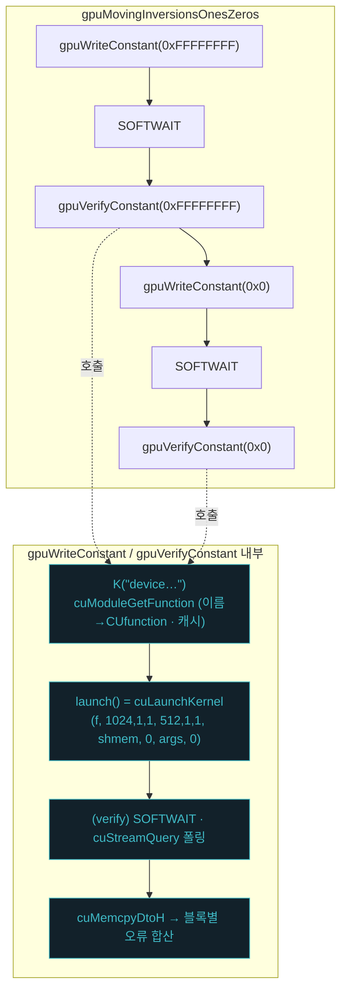

# MemtestG80 — CUDA Driver API **교육용 간결 버전** (`driver_api_study/`)

이 디렉터리는 [`driver_api/`](../driver_api/)(CUDA Driver API 판)를 **교재로 더 읽기 쉽게** 다듬어 가는 버전입니다.
목표는 **CUDA(빌드·커널 로딩·실행)와 직접 관련 없는 코드를 걷어내** 핵심만 남기는 것입니다.

> 원리·개념 설명은 세미나 부록을 참고하세요: [`docs/seminar/부록1_DriverAPI_빌드와_커널로딩.md`](../docs/seminar/부록1_DriverAPI_빌드와_커널로딩.md)

## `driver_api/` 대비 변경 (단계별)

1. **ezOptionParser.hpp 제거** ✅
   - 서드파티 명령행 파서(`ezOptionParser.hpp`)는 CUDA와 직접 관련이 없어 삭제했습니다.
   - `memtestG80_cli.cpp` 가 표준 C++ 만으로 인자를 직접 파싱합니다
     (`-g/--gpu N`, 위치 인자 `[MB] [iters]` — 동작·기본값은 동일).

2. **라이선스 출력 제거** ✅
   - `-l/--license` 플래그와 `print_licensing()`(라이선스 문구 출력)을 삭제했습니다. CUDA 동작과 무관한 부가 기능입니다.
   - (라이선스는 여전히 LGPL v3 — 코드 상단 주석·본 README 참조.)

3. **대역폭 측정 제거** ✅
   - 시작 시의 device-to-device 복사 기반 대역폭 측정 블록을 삭제했습니다.
   - 이제 쓰이지 않는 `gpuMemoryBandwidth`(free 함수 + `memtestState` 메서드)도 `core`에서 함께 제거했습니다.

4. **13종 테스트 → 대표 1종만** ✅
   - CLI 테스트 루프를 **Moving Inversions (ones and zeros)** 한 종류만 남겼습니다.
   - 이 테스트는 **쓰기 커널(`deviceWriteConstant`)** 과 **공유 메모리 트리 리덕션이 있는 검증 커널(`deviceVerifyConstant`)** 을 모두 사용해, 커널 로딩·실행 흐름을 온전히 보여줍니다.
   - 여러 테스트의 합산용 배열(`errorCounts[]`)·미사용 변수·`<cstring>` include도 함께 정리했습니다.
   - (당시엔 `core`/`kernels.cu` 에 미사용 함수·커널이 남아 있었고, 아래 5단계에서 정리했습니다.)

5. **미사용 커널·함수 정리** ✅
   - `kernels.cu`: 대표 테스트가 쓰는 **`deviceWriteConstant` · `deviceVerifyConstant` 2개만** 남기고, 나머지 커널(LCG·페어상수·워킹32·랜덤블록·모듈로)과 PRNG `__device__` 헬퍼(`deviceRan0p` 등)·`LCGLOOP`/`THREAD_OFFSET` 매크로를 제거.
   - `core.h`/`core.cpp`: `gpuWriteConstant`/`gpuVerifyConstant`/`gpuMovingInversionsOnesZeros` 및 `memtestState`의 대표 메서드만 남기고 나머지 `gpuXxx`(저수준 함수 + 메서드)와 `lcgPeriod`/`setLCGPeriod`/`getLCGPeriod`, 미사용 `SOFTWAIT_LIM` 를 제거.
   - 결과: 소스 총 **1049줄 → 485줄** (약 54% 감소), `ezOptionParser.hpp`(~69KB)까지 포함하면 더 큼.

6. **배너·cubin 경로 탐색 단순화 → 단일 파일화** ✅
   - `print_usage` 배너를 2줄로, cubin 경로 탐색을 기본값 + 환경변수 override 로 단순화.
   - **`memtestG80_core.{h,cpp}` 를 제거**하고 그 내용(모듈 관리·`gpuWriteConstant`/`Verify`·타이머·SOFTWAIT·메모리 할당)을 `memtestG80_cli.cpp` 로 합쳤습니다.
   - 이제 소스는 **호스트 1파일 + 커널 1파일 + Makefile** 뿐입니다.

## 구성

| 파일 | 역할 |
|---|---|
| `memtestG80_kernels.cu` | 디바이스 커널 2개 (`deviceWriteConstant`/`deviceVerifyConstant`, `extern "C"`) → cubin |
| `memtestG80_cli.cpp` | **단일 호스트 파일** — 인자 파싱 + 디바이스/컨텍스트/cubin 로드 + 모듈 관리 + 커널 실행 + 대표 테스트 1종 |
| `Makefile` | Linux x64 빌드 (cubin + 호스트 단일 파일 링크 `-lcuda`) |

> 호스트 코드는 이제 **파일 하나**(`memtestG80_cli.cpp`)입니다. Driver API 핵심 흐름을 한 파일에서 위→아래로 읽을 수 있습니다.

## 실행 흐름 (단일 파일)

`memtestG80_cli.cpp` 의 `main()` 이 위에서 아래로 밟는 Driver API 수명주기입니다.



대표 테스트가 커널을 부르는 부분(로딩·실행의 핵심)을 확대하면:



- **cuModuleLoad**(cubin→모듈) → **cuModuleGetFunction**(이름→함수, `K()` 캐시) → **cuLaunchKernel** 이 로딩·실행의 3핵심입니다.
- `deviceVerifyConstant` 는 공유 메모리 트리 리덕션으로 블록별 오류 수를 만들고, 호스트가 `cuMemcpyDtoH` 로 받아 합산합니다.

## 빌드 & 실행

```bash
cd driver_api_study
make SMARCH=sm_75        # 대상 GPU 아키텍처 지정
./memtestG80 128 50      # 128MB, 50회
./memtestG80 --gpu 0 256 100
```

- 대상: **Linux x86-64 전용** · 단일 GPU
- 라이선스: LGPL v3 (원본과 동일)
