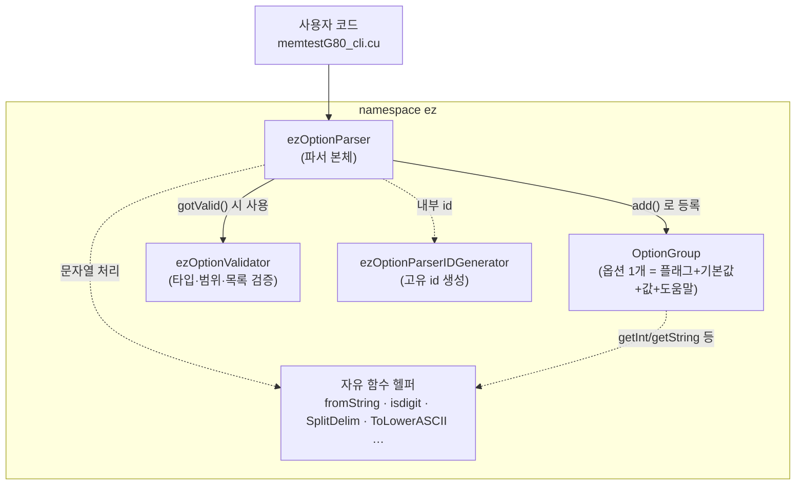
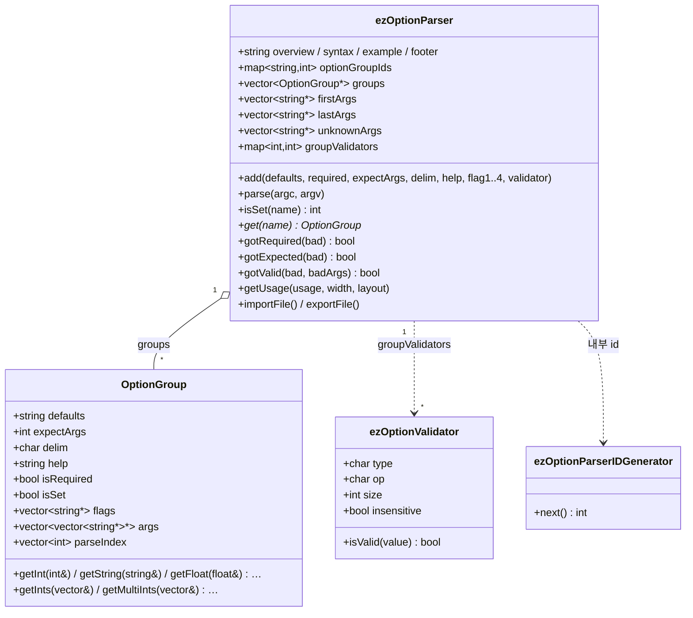
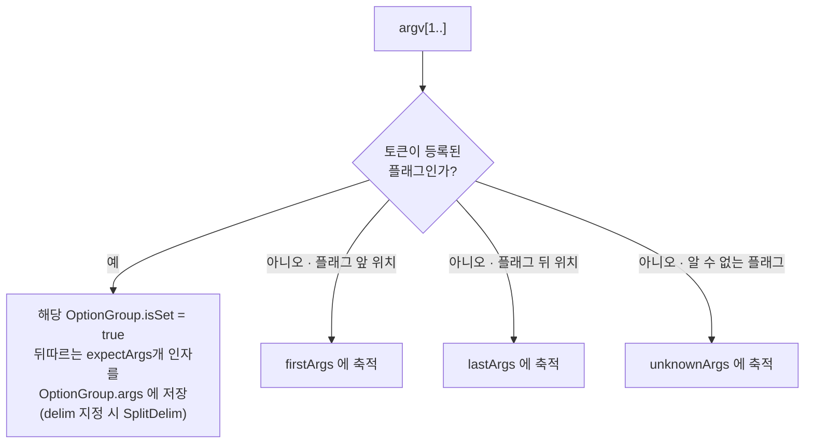
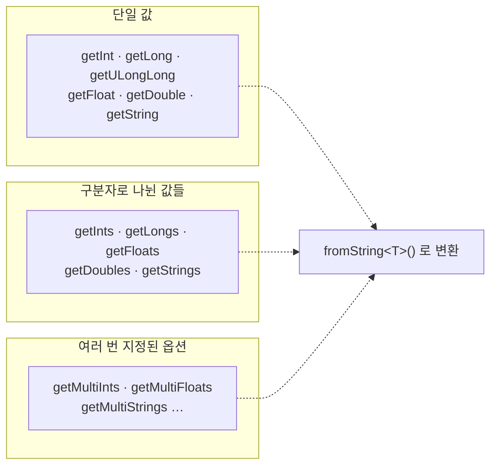
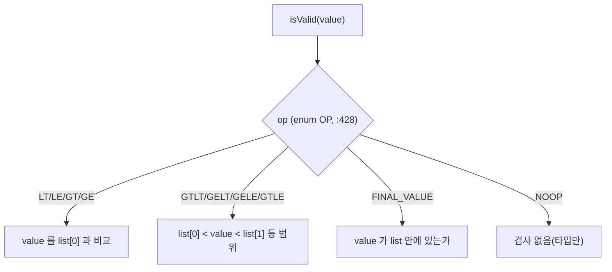
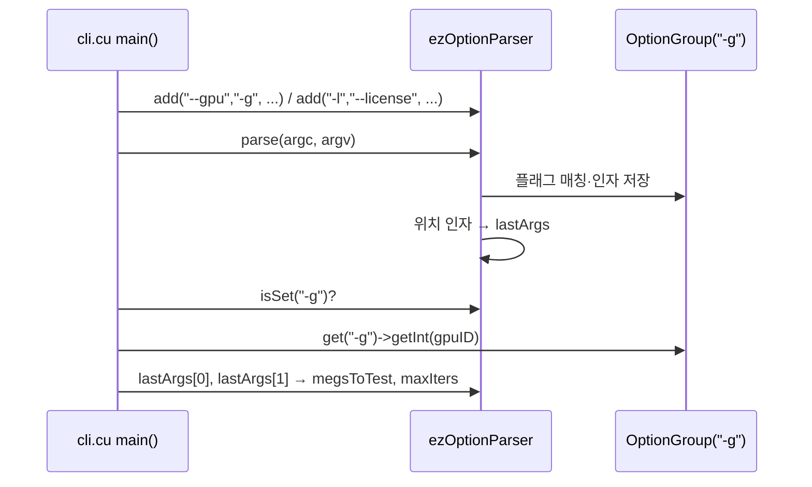

# `ezOptionParser.hpp` 코드 분석 (한국어)

> **헤더 전용(header-only) C++ 명령행 인자 파서** 라이브러리입니다. MemtestG80 자체 코드가 아니라
> [`memtestG80_cli.cu`](memtestG80_cli.cu)가 `--gpu`, `--license` 같은 플래그를 파싱하는 데 사용하는
> **서드파티 의존성**입니다. (약 2,153줄)
> 이 문서는 라이브러리의 구조를 블록 다이어그램과 함께 설명합니다. 코드 참조는 `파일:줄번호` 기준입니다.

- 원작자: **Remik Ziemlinski** · 라이선스: **MIT** (`MIT-LICENSE` 참조) · 버전: v0.2.1 (2013)
- 네임스페이스: `ez` (`ezOptionParser.hpp:32`)
- "헤더 전용"이라 모든 메서드가 `inline`으로 선언됩니다 — 여러 번역 단위에서 인클루드해도 다중 정의
  링커 오류가 나지 않도록 하기 위함(`v0.1.3` 체인지로그 참조).

---

## 1. 큰 그림 — 구성 요소



| 클래스 | 위치 | 역할 |
|---|---|---|
| `ezOptionParser` | `:1314` | 파서 본체 — 옵션 등록, 파싱, 조회, 사용법 출력 |
| `OptionGroup` | `:929` | 옵션 하나의 상태 (플래그 목록·기본값·입력된 값·도움말·필수 여부) |
| `ezOptionValidator` | `:406` | 인자의 타입/연산자/목록 기반 유효성 검사 |
| `ezOptionParserIDGenerator` | `:389` | 헤더 전용 정적 변수 문제를 우회한 고유 id 발급기 |
| 자유 함수들 | `:36~` | `fromString`, `isdigit`, `SplitDelim`, `ToLowerASCII` 등 문자열 유틸 |

---

## 2. 클래스 관계



---

## 3. 사용 생애주기


1. **등록** `add()` (`:1321~1324`, 오버로드로 플래그 1~4개 지원):
   `add(기본값, 필수여부, 기대인자수, 구분자, 도움말, flag1[, flag2..4], validator)`
2. **파싱** `parse()` (`:1335`): `argv`를 훑어 플래그를 인식하고, 뒤따르는 인자를 해당 `OptionGroup.args`에 채움.
3. **조회**: `isSet(name)` (`:1333`)로 플래그 존재 여부, `get(name)` (`:1326`)로 `OptionGroup*`를 얻어
   `getInt/getString/...`로 값 추출.
4. **검증**: `gotRequired`(필수 누락), `gotExpected`(기대 인자 수 불일치), `gotValid`(validator 위반) (`:1329~1331`).
5. **사용법 출력**: `getUsage` (`:1327`) — `ALIGN`/`INTERLEAVE`/`STAGGER` 레이아웃 지원(`:1317`).

---

## 4. `parse()` 데이터 흐름

argv의 각 토큰을 등록된 플래그와 대조해 세 종류의 버킷으로 분류합니다.



- `firstArgs` / `lastArgs` (`:1339` 부근): 어떤 플래그에도 속하지 않는 **위치 인자**를, 첫 플래그
  **이전/이후**로 나눠 담습니다.
- `unknownArgs`: 인식하지 못한 플래그.
- `parseIndex` (OptionGroup 멤버): 같은 옵션이 여러 번 나올 때 각 등장의 argv 인덱스를 기록(v0.2.0 추가).

---

## 5. 값 추출 — `OptionGroup`의 게터 (`:942~962`)

옵션에 들어온 문자열 인자를 원하는 타입으로 변환합니다. 단일값·벡터·다중그룹(구분자 분리) 3계열.



내부적으로 템플릿 헬퍼 `fromString<T>()` (`:37`)가 `istringstream`으로 문자열→타입 변환을 수행합니다.

---

## 6. 검증기 `ezOptionValidator` (`:406`)

옵션 인자가 특정 **타입**이고 특정 **연산자** 조건을 만족하는지 검사합니다.

```
타입 코드 (enum TYPE, :440):  S1 U1 S2 U2 S4 U4 S8 U8 F D T
  → 8/16/32/64비트 부호·무부호 정수, Float, Double, Text
```



`gotValid()`가 각 옵션의 validator를 돌려 위반 옵션·인자를 `badOptions`/`badArgs`로 모읍니다.
(MemtestG80 CLI는 validator를 쓰지 않고 타입/범위 검사는 자체 `validateNumeric`으로 처리합니다.)

---

## 7. MemtestG80에서의 실제 사용 (`memtestG80_cli.cu`)

```c
ez::ezOptionParser opt;
// --gpu / -g : 1개 인자 기대 (cli.cu:83)
opt.add("0", 0, 1, 0, "run test on the Nth (from 0) CUDA GPU", "--gpu", "-g");
// -l / --license : 인자 없음 (cli.cu:93)
opt.add("",  0, 0, 0, "show license terms for this build\n", "-l", "--license");

opt.parse(argc, argv);                 // cli.cu:103
if (opt.isSet("-g")) opt.get("-g")->getInt(gpuID);   // cli.cu:105~106
if (opt.lastArgs.size() == 2) {        // 위치 인자 [MB] [iters] (cli.cu:111)
    sscanf(opt.lastArgs[0]->c_str(), "%u", &megsToTest);
    sscanf(opt.lastArgs[1]->c_str(), "%u", &maxIters);
}
```



> **원본 코드의 사소한 버그** (`cli.cu:108`): `--license` 처리에서 `opt.get("-l")`가 아니라
> 실수로 `opt.get("-g")->getInt(showLicense)`를 호출합니다. 이 파서 라이브러리 자체의 문제가 아니라
> 호출부의 오타입니다.

---

## 8. 헤더 전용 설계의 특징

- **모든 메서드 `inline`**: 단일 헤더를 여러 `.cpp`/`.cu`에서 인클루드해도 다중 정의 오류가 나지 않음.
- **`ezOptionParserIDGenerator`** (`:389`): 헤더 안 정적 변수의 번역 단위 문제를 우회해 고유 id를 발급
  (체인지로그 v0.1.3에 배경 설명).
- **표준 라이브러리만 의존**: `<vector> <list> <map> <string> <sstream>` 등 (`:20~30`) — 외부 의존성 없음.
- **파일 입출력 지원**: `importFile()`/`exportFile()`로 옵션을 파일에서 읽거나 내보낼 수 있음(`:1325,1332`).

---

## 9. 읽기 순서 제안

1. `namespace ez`의 자유 헬퍼 (`:36~300`) — `fromString`, `SplitDelim` 등 기반 도구
2. `OptionGroup` (`:929`) — 옵션 하나의 상태와 게터
3. `ezOptionParser::add` / `parse` (`:1420~`) — 등록과 파싱의 핵심
4. `memtestG80_cli.cu`의 실제 사용부 (`cli.cu:81~116`)로 연결

---

*이 문서는 서드파티 라이브러리 `ezOptionParser.hpp`(MIT, Remik Ziemlinski)의 소스를 1차 자료로 삼아
작성한 한국어 분석입니다. 라이브러리 자체의 라이선스·저작권은 원저작자에게 있으며, 코드가 갱신되면 줄 번호를
재확인하세요.*
