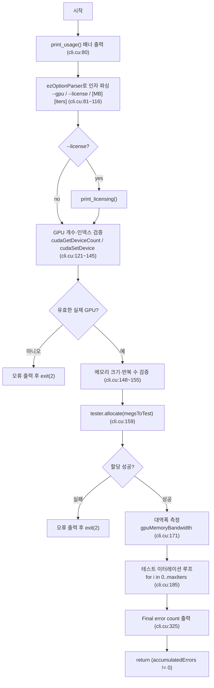
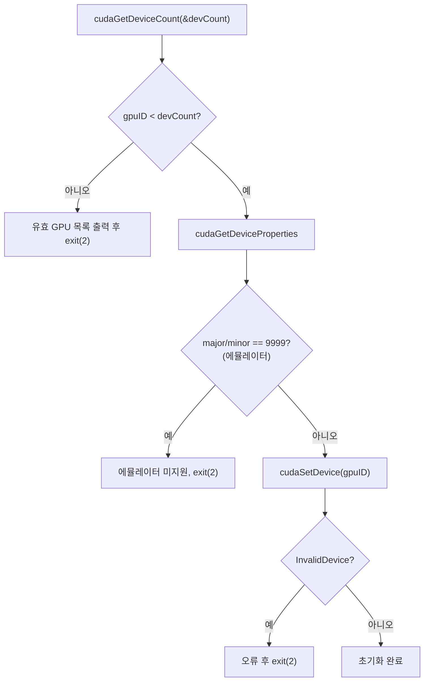
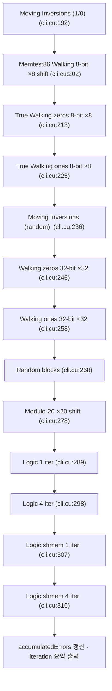
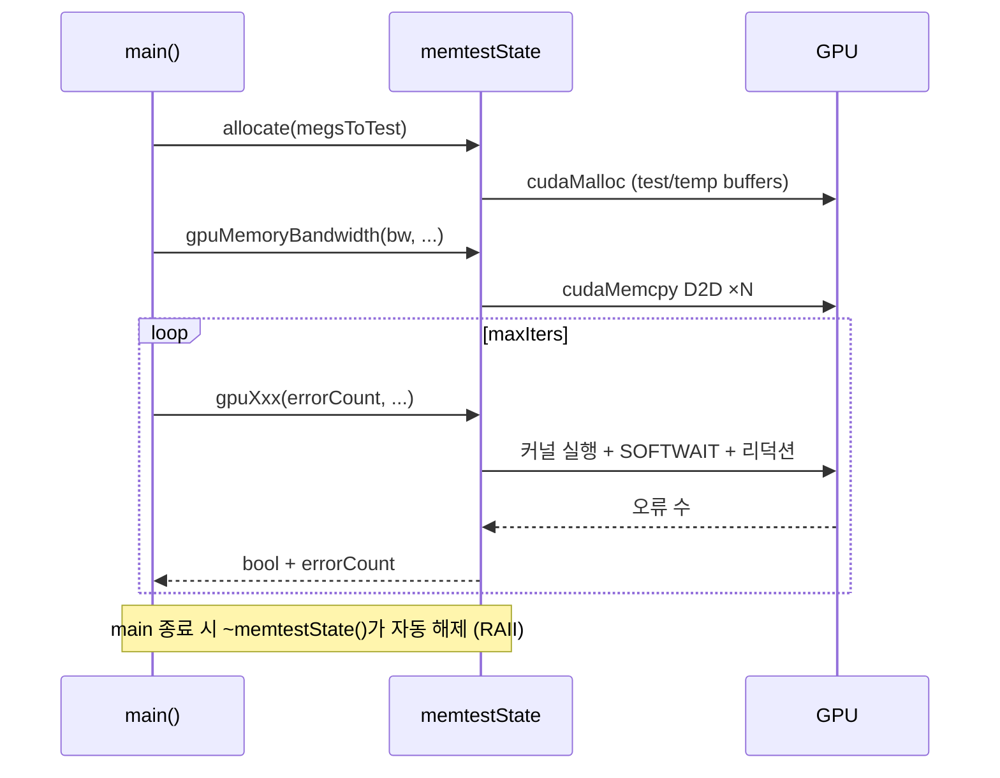

# `memtestG80_cli.cu` 코드 분석 (한국어)

> MemtestG80의 **명령행 프런트엔드**이자, 핵심 라이브러리를 임베드하는 **사용 예제**입니다. (약 327줄)
> `main()`이 인자를 파싱하고, GPU를 초기화하고, `memtestState`로 13종 테스트를 반복 실행합니다.
> 이 문서는 소스 구조를 블록 다이어그램과 함께 설명합니다. 코드 참조는 `파일:줄번호` 기준입니다.

- 저자: Imran Haque, Stanford University (2009) · 라이선스: LGPL v3
- 핵심 라이브러리: [`memtestG80_core.cu`](memtestG80_core.cu) / [`memtestG80_core.h`](memtestG80_core.h)
- 인자 파서: `ezOptionParser.hpp` (헤더 전용)

---

## 1. `main()`의 큰 흐름



- 기본값: `megsToTest=128`, `maxIters=50`, `gpuID=0` (`cli.cu:74~77`)
- 종료 코드: 누적 오류가 0이 아니면 **non-zero** 반환 → 스크립트 연동이 쉬움 (`cli.cu:326`)

---

## 2. 인자 파싱 (`ezOptionParser`)

| 인자 | 플래그 | 의미 | 기본값 |
|---|---|---|---|
| GPU 선택 | `--gpu`, `-g` | 시험할 CUDA GPU 인덱스(0부터) | 0 |
| 라이선스 표시 | `--license`, `-l` | 라이선스 약관 출력 | — |
| 위치 인자 1 | — | 시험할 RAM 메가바이트 | 128 |
| 위치 인자 2 | — | 테스트 이터레이션 횟수 | 50 |

```
memtestG80                 # GPU 0, 128MB, 50회
memtestG80 256 100         # 256MB, 100회
memtestG80 --gpu 2 512 20  # 3번째 GPU, 512MB, 20회
```

- 위치 인자는 `opt.lastArgs`로 받아 `sscanf`로 파싱 (`cli.cu:109~116`)
- 메모리 크기는 **항상 반복 횟수보다 앞**에 와야 함

> ⚠️ 원본 코드 특이점 (`cli.cu:108`): `--license` 처리에서 `opt.get("-g")->getInt(showLicense)`로
> 실수로 `-g` 값을 읽습니다(`-l`이 아니라). 분석 시 참고하세요 — 동작상 큰 영향은 없지만 원저자의
> 사소한 버그로 보입니다.

---

## 3. GPU 초기화·검증



(`cli.cu:121~145`) — 잘못된 인덱스면 시스템의 유효 CUDA 장치 목록을 친절히 출력합니다.

---

## 4. 한 이터레이션이 돌리는 13종 테스트 (`cli.cu:185~324`)

루프 본문은 `memtestState`의 메서드를 순서대로 호출하고, 각 테스트의 오류 수와 소요 ms를 출력합니다.
`errorCounts[15]` 배열에 테스트별 누적치를 모읍니다.



> Walking·Modulo 계열은 `shift`를 8·32·20회 반복하므로, **실제 커널 실행 횟수는 13보다 훨씬 많습니다.**
> Random blocks·Modulo는 매 이터레이션 새 `rand()` 값을 받아 실행마다 커버리지를 넓힙니다.

각 테스트 호출의 전형적 패턴:

```c
// 예: Memtest86 Walking 8-bit (cli.cu:199~208)
errorCount = 0;
start = getTimeMilliseconds();
for (uint shift = 0; shift < 8; shift++) {
    tester.gpuWalking8BitM86(iterErrors, shift);
    errorCount += iterErrors;
}
end = getTimeMilliseconds();
accumulatedErrors += errorCount;
errorCounts[1] += errorCount;
printf("\tMemtest86 Walking 8-bit: %u errors (%u ms)\n", errorCount, end-start);
```

---

## 5. 라이브러리 임베드 패턴 (이 파일의 교육적 가치)

`cli.cu`는 `memtestState`를 쓰는 **최소 임베드 예제**입니다.



핵심: 사용자는 `allocate` → 각 `gpuXxx` 호출만 하면 되고, `cudaFree`를 직접 부를 필요가 없습니다
(소멸자가 정리). 이것이 MemtestG80의 원래 목적 — 다른 소프트웨어가 실행 전 GPU 건전성을 검증하는 것.

---

## 6. 결과 해석 (강사·사용자용)

| 출력 | 의미 |
|---|---|
| `Estimated bandwidth ... MB/s` | 첫 줄, D2D 복사 실효 대역폭 |
| `Test iteration k (...): N errors so far` | 이터레이션 진행 상황 |
| 테스트별 `... : N errors (M ms)` | 각 테스트의 오류 수·소요 시간 |
| `Final error count ...` | 전체 누적 오류 |
| **40억을 넘는 오류 수** | 진짜 결함이 아니라 **타임아웃/런치 실패 센티넬** → 영역을 줄이면 사라짐 |

정상 GPU는 오류 0이 기대됩니다. 산발적 결함을 잡으려면 **크게, 수천 회** 돌려야 합니다.

---

## 7. 함수 요약

| 함수 | 위치 | 역할 |
|---|---|---|
| `validateNumeric` | `cli.cu:31` | 인자가 10자리 이하 숫자인지 검사 |
| `print_usage` | `cli.cu:42` | 배너·사용법 출력 |
| `print_licensing` | `cli.cu:58` | 라이선스 문구 출력 |
| `main` | `cli.cu:73` | 파싱 → GPU 검증 → 할당 → 대역폭 → 13종 테스트 루프 → 종료 코드 |

---

*이 문서는 소스 코드를 1차 자료로 삼아 작성한 한국어 분석입니다. 코드가 갱신되면 줄 번호를 재확인하세요.*
