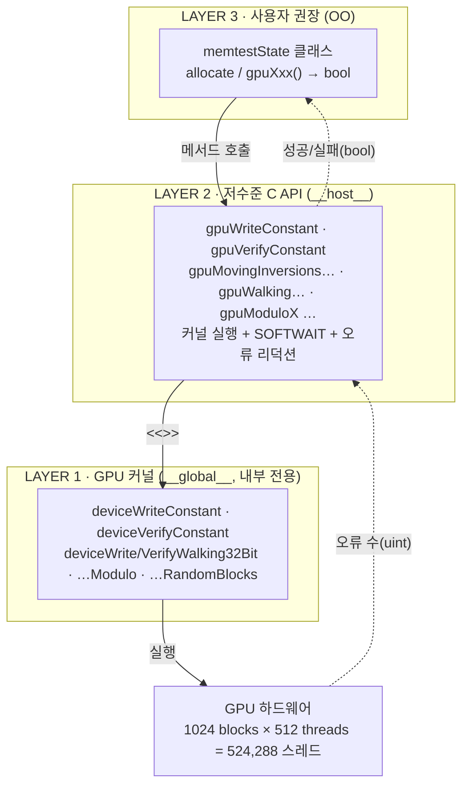
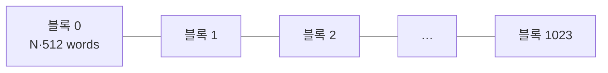
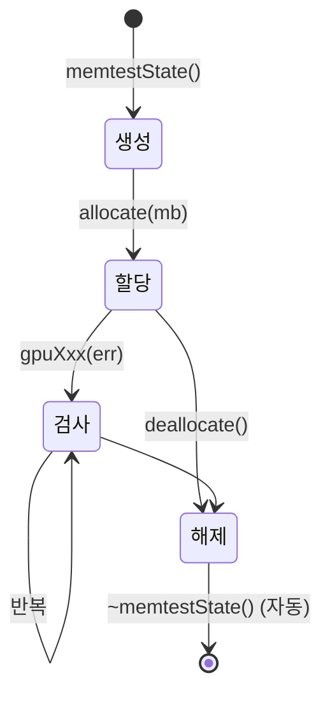
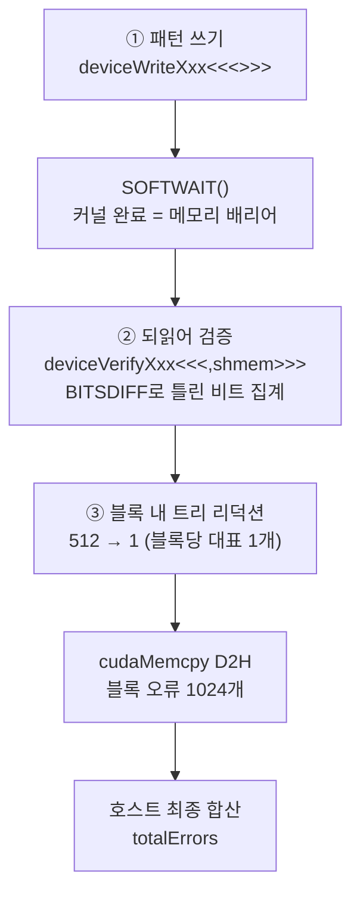
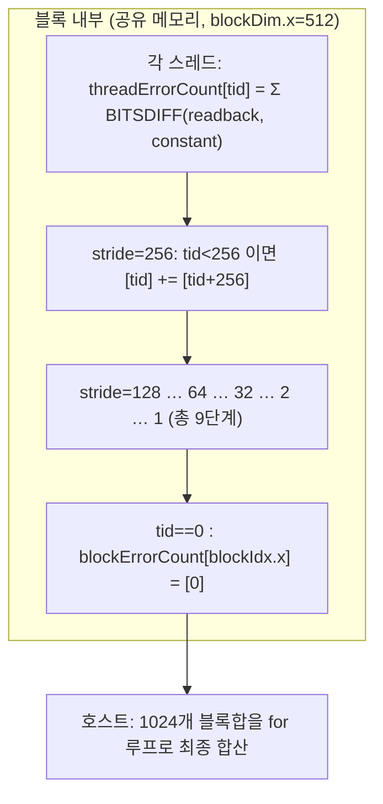
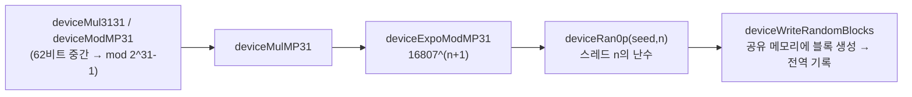
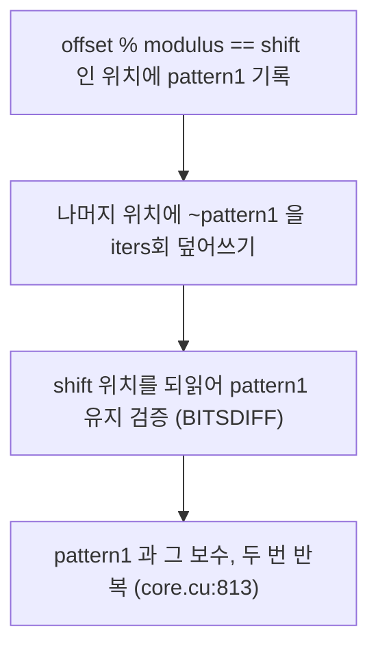

# `memtestG80_core.cu` 코드 분석 (한국어)

> MemtestG80의 **핵심 라이브러리** — 모든 CUDA 커널, 호스트 래퍼, 병렬 리덕션, 대역폭 측정, 그리고
> 객체지향 인터페이스(`memtestState`)가 이 한 파일에 들어 있습니다. (약 880줄)
> 이 문서는 소스의 구조를 블록 다이어그램과 함께 설명합니다. 코드 참조는 `파일:줄번호` 기준입니다.

- 저자: Imran Haque, Stanford University (2009) · 라이선스: LGPL v3
- 짝 헤더: [`memtestG80_core.h`](memtestG80_core.h) · 사용 예제: [`memtestG80_cli.cu`](memtestG80_cli.cu)

---

## 1. 큰 그림 — 3계층 아키텍처

한 기능이 세 계층으로 나뉘어 **재사용**과 **캡슐화**를 이룹니다.



**네이밍 규칙** (`core.cu:22` 주석): `gpuXxx`/`cpuXxx` = 사용자 접근 가능, `deviceXxx` = 내부 커널.

---

## 2. 핵심 매크로

| 매크로 | 위치 | 역할 |
|---|---|---|
| `THREAD_ADDRESS(base,N,i)` | `core.cu:26` | 스레드가 `i`번째 반복에 건드릴 word의 **절대 주소** |
| `THREAD_OFFSET(N,i)` | `core.cu:27` | 같은 계산의 **오프셋** 버전 (Modulo 테스트용) |
| `BITSDIFF(x,y)` | `core.cu:28` | `__popc((x)^(y))` — 두 워드에서 **다른 비트의 개수** |
| `SOFTWAIT()` | `core.h:49` | 커널 완료를 슬립 폴링으로 대기 (타임아웃 시 `0xFFFFFFFE` 반환) |
| `CHECK_LAUNCH_ERROR()` | `core.h:59` | 커널 런치 실패 시 `0xFFFFFFFF` 반환 |

### THREAD_ADDRESS 분해

```
THREAD_ADDRESS(base, N, i) = base
                           + blockIdx.x * N * blockDim.x   ← 이 블록의 구역 시작
                           + i * blockDim.x                ← 블록 안 i번째 반복 오프셋
                           + threadIdx.x                   ← 내 스레드 위치 (0~511)
```



같은 반복 `i`에서 **이웃 스레드(threadIdx.x)가 이웃 주소**를 맡습니다 → 워프의 접근이 하나의 트랜잭션으로
묶이는 **메모리 병합(coalescing)** 이 일어나 대역폭을 최대화합니다.

---

## 3. 자료구조 — `memtestState` 생애주기



- `allocate(mb)` (`core.cu:51`): `mb`를 2의 배수로 반올림 → `megsToTest`, `loopIters(N) = megsToTest/2`.
  세 버퍼를 확보하고, 하나라도 실패하면 이미 잡은 것을 되돌리고 `0` 반환(예외 안전, `try/throw`).
  - `devTestMem` — 실제 시험 대상 전역 메모리 (수백 MB~GB)
  - `devTempMem` — 블록별 오류 수 (`nBlocks`개 uint)
  - `hostTempMem` — 위를 CPU로 복사해 최종 합산할 버퍼
- 상수 멤버: `nBlocks(1024)`, `nThreads(512)` (`core.h:78`)
- 소멸자가 `deallocate()`를 호출 → GPU 메모리 자동 해제(RAII, `core.cu:79`)

---

## 4. 모든 테스트의 뼈대 — 쓰기 → 검증

거의 모든 테스트가 이 3단 흐름을 공유합니다.



**왜 쓰기와 읽기를 나누나?** 커널 런치는 비동기이므로, 커널이 끝나야(SOFTWAIT) 모든 스레드의 쓰기가
전역 메모리에 확실히 반영됩니다. 그다음 읽어야 올바른 값을 검증할 수 있습니다.

### 가장 단순한 두 커널

```c
// core.cu:189 — 쓰기
__global__ void deviceWriteConstant(uint* base, uint N, const uint constant) {
    for (uint i = 0; i < N; i++)
        *(THREAD_ADDRESS(base,N,i)) = constant;   // 각 스레드가 자기 word들을 채움
}
```

경계 검사가 없는 이유: 시험 영역이 항상 `2·N MiB`로 그리드에 딱 맞게 할당되어 범위를 벗어나는 스레드가
없기 때문입니다. 복잡함은 `THREAD_ADDRESS`가 모두 흡수합니다.

---

## 5. 병렬 리덕션 — 이 파일의 백미 (`deviceVerifyConstant`, core.cu:213)

52만 개 스레드가 각자 센 오류를 하나의 숫자로 합치는 방법. 전역 원자합의 경합을 피하고 **계층적으로** 줄입니다.



트리 리덕션(8개 예시, stride 반씩 축소):

```
초기(stride=4)  [ 3  1  4  1  5  9  2  6 ]
1단계 후        [ 8 10  6  7  ·  ·  ·  · ]   [i] += [i+4]
2단계 후        [14 17  ·  ·             ]   [i] += [i+2]
3단계 후 = 블록합 [31                     ]   [i] += [i+1]
```

> **★ `__syncthreads()` (core.cu:228) 는 각 단계마다 필수**입니다. 없으면 일부 스레드가 아직 안 써진
> 값을 읽어, 정상 GPU인데도 합계가 실행마다 달라지는(비결정적) 버그가 생깁니다.

공유 메모리 크기는 런치의 세 번째 `<<<grid, block, shmem>>>` 인자로 지정: `sizeof(uint)*nThreads` (core.cu:198).

---

## 6. 테스트 카탈로그 (호스트 함수)

| 테스트 (호스트 함수) | 위치 | 노리는 결함 |
|---|---|---|
| Moving Inversions (1/0) `gpuMovingInversionsOnesZeros` | `core.cu:370` | stuck bit, 인접 간섭 |
| Moving Inversions (random) `gpuMovingInversionsRandom` | `core.cu:527` | 값 의존적 오류 |
| Walking 8-bit M86 `gpuWalking8BitM86` | `core.cu:392` | 데이터 라인 단락 |
| True Walking 8-bit `gpuWalking8Bit` | `core.cu:435` | 주소·데이터 결합 결함 |
| Walking 32-bit `gpuWalking32Bit` | `core.cu:552` | 전체 워드폭 데이터 라인 |
| Random Blocks `gpuRandomBlocks` | `core.cu:626` | 무작위 패턴·재현 검증 |
| Modulo-20 `gpuModuloX` | `core.cu:802` | 주기적 주소 간섭 |
| Logic (LCG) `gpuShortLCG0` | `core.cu:277` | 연산 로직·반복 카운트 |
| Logic (shared mem) `gpuShortLCG0Shmem` | `core.cu:285` | shared mem·셰이더 오버클럭 |
| 대역폭 `gpuMemoryBandwidth` | `core.cu:168` | 실효 대역폭 측정 |

패턴마다 다른 것은 "패턴 생성" 뿐, write/verify/리덕션 뼈대는 공통 재사용입니다.

---

## 7. 로직 테스트 — 메모리가 아니라 연산을 본다 (LCG)

```c
// core.cu:298 — LCGLOOP 매크로 (요지)
for (rep = 0; rep < repeats; rep++) {
    value = ~value;
    for (iter = 0; iter < period; iter++) {  // 짧은 주기 LCG
        value = ~value; value = a*value + c; // LCG 스텝
        value ^= 0xFFFFFFF0; value ^= 0xF;   // 짝 XOR (명령 다양성; 단일 XOR은 NOT으로 최적화되어 사라짐)
    }
    value = ~value;
}   // 끝나면 value == 0 이어야 정상
```

주기 후 항상 0으로 복귀하도록 설계 → 반복 횟수 `k`가 달라도 결과가 같아야 하므로, 차이가 나면 **로직 오류**.
`gpuShortLCG0Shmem`(core.cu:346)은 중간값을 공유 메모리에 둬 셰이더 오버클럭 오류에 더 민감합니다.

---

## 8. Random Blocks — GPU 상 병렬 PRNG

메르센 소수 `2^31−1` 기반의 Park–Miller ran0을 병렬 폐형식(closed-form)으로 구현해, 각 스레드가 자기
위치의 난수를 독립 생성합니다.



- `deviceRan0p` (`core.cu:702`): 스레드 병렬 폐형식 ran0. 상위 비트가 항상 0이라, `deviceIrbit2`(core.cu:708)로
  무작위 비트를 상위에 OR.
- 쓰기 커널(`core.cu:723`)은 `__syncthreads()`로 다음 라운드 시드를 안전하게 넘김(경쟁 조건 방지).
- 검증 커널(`core.cu:748`)은 같은 시드로 수열을 재생성해 비교 (공유 메모리 `12*nThreads` 바이트 사용).

---

## 9. Modulo-20 — 주기적 주소 간섭



`THREAD_OFFSET` + `% modulus`로 20 word 간격의 위치만 표적. 스트라이드 20이 메모리 칩의 아키텍처적
스트라이드와 정렬되지 않아 물리적으로 흩어진 셀 간 간섭을 잘 드러냅니다. (`core.cu:834`, `850`)

---

## 10. 대역폭 측정 (`gpuMemoryBandwidth`, core.cu:168)

```c
for (uint i = 0; i < iters; i++)
    cudaMemcpy(dst, src, bytes, cudaMemcpyDeviceToDevice); // D2D
cudaThreadSynchronize();                 // ★ D2D는 비동기 → 동기화 후 시간 측정
double bw = 2.0 * (mbToTest*iters) / seconds; // 읽기+쓰기 → ×2
```

동기화 없이 시간을 재면 비현실적으로 큰 값이 나옵니다(복사가 아직 안 끝남). 기대치보다 크게 낮으면 그
자체가 하드웨어·드라이버 이상 신호입니다.

---

## 11. 오류 반환 관례 (센티넬)

| 반환값 | 의미 | 발생원 |
|---|---|---|
| 정상 소수 | 실제 비트 오류 수 | `__popc` 합계 |
| `0xFFFFFFFF` (≈42.9억) | 커널 런치 실패 | `CHECK_LAUNCH_ERROR` |
| `0xFFFFFFFE` (≈42.9억) | 커널 타임아웃 | `SOFTWAIT` |

`memtestState`의 `gpuXxx` 메서드(예: `core.cu:102`)는 이 센티넬을 걸러 `bool false`로 변환합니다. 그래서
CLI에서 "40억을 넘는 오류"가 보이면 진짜 결함이 아니라 타임아웃입니다.

---

## 12. 읽기 순서 제안

1. `THREAD_ADDRESS` 매크로 (`core.cu:26`) — 모든 테스트의 심장
2. `deviceWriteConstant` (`core.cu:189`) — 가장 단순한 커널
3. `deviceVerifyConstant` (`core.cu:213`) — `__popc` + 병렬 리덕션
4. `gpuMovingInversionsOnesZeros` (`core.cu:370`) — 뼈대의 첫 완성형
5. 나머지 테스트는 "패턴 생성만 다르고 뼈대는 같다"는 눈으로 훑기

---

*이 문서는 소스 코드를 1차 자료로 삼아 작성한 한국어 분석입니다. 코드가 갱신되면 줄 번호를 재확인하세요.*
