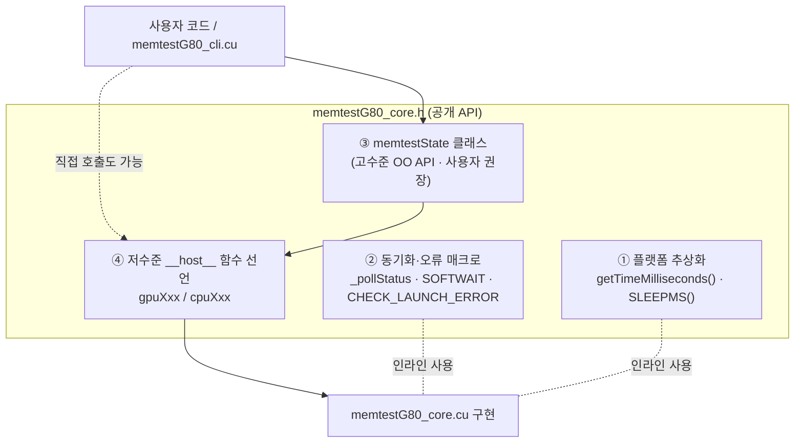
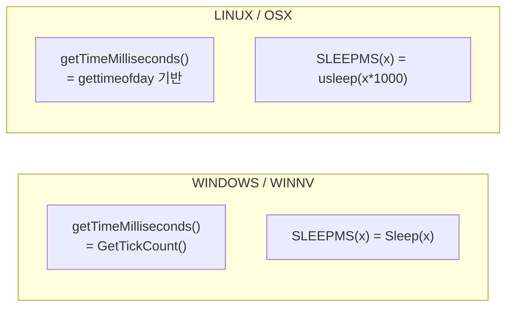
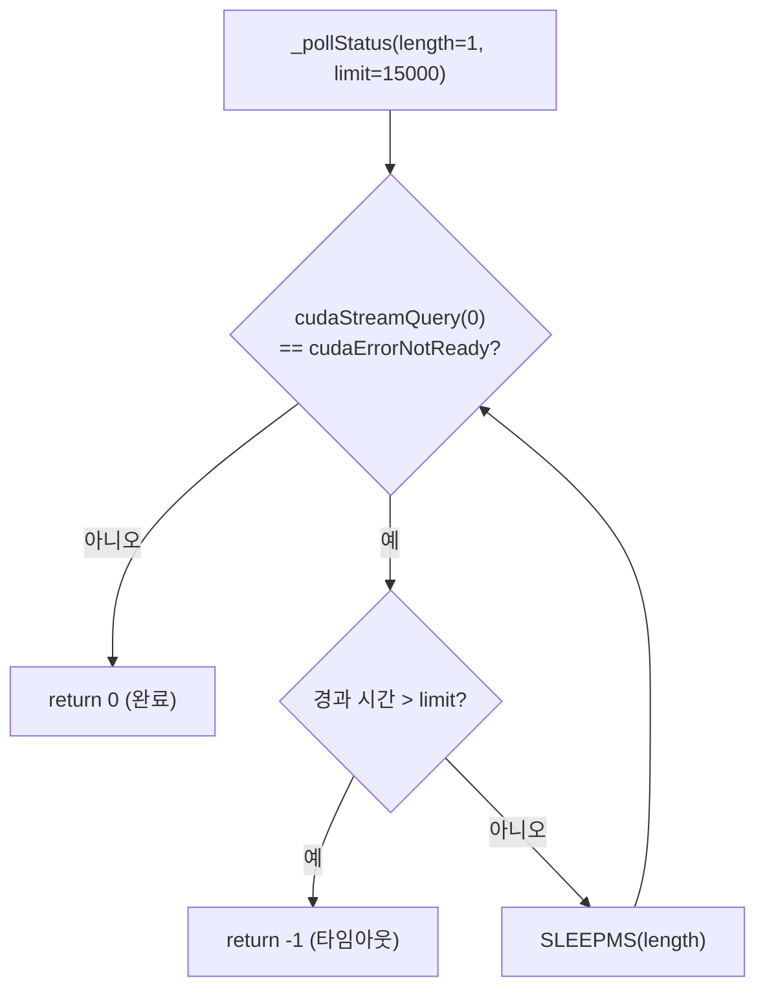
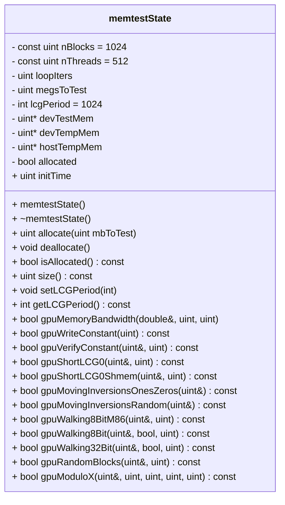
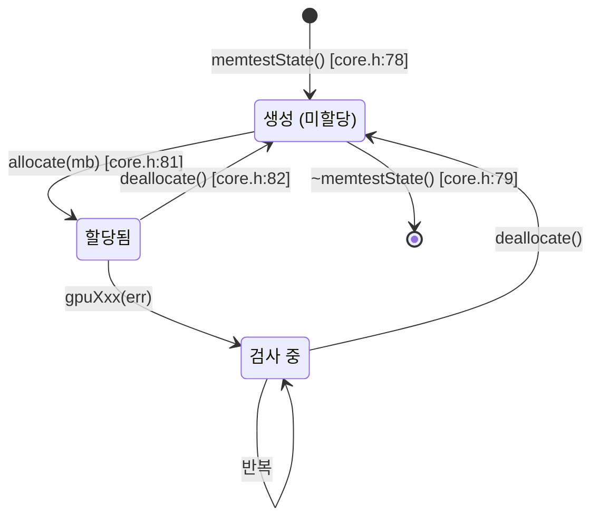
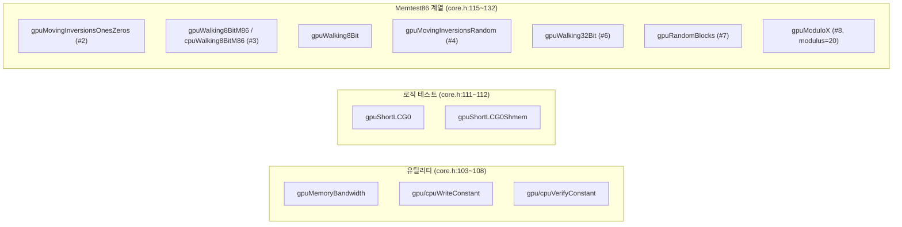

# `memtestG80_core.h` 코드 분석 (한국어)

> MemtestG80의 **공개 API 헤더**입니다. 플랫폼 추상화 매크로, 커널 완료 대기(`SOFTWAIT`)·오류 검사
> 매크로, 객체지향 인터페이스 `memtestState` 클래스, 그리고 저수준 `__host__` 함수 선언이 모두 여기에
> 있습니다. (134줄)
> 이 문서는 헤더의 구조를 블록 다이어그램과 함께 설명합니다. 코드 참조는 `파일:줄번호` 기준입니다.

- 저자: Imran Haque, Stanford University (2009) · 라이선스: LGPL v3
- 구현부: [`memtestG80_core.cu`](memtestG80_core.cu) · 사용 예제: [`memtestG80_cli.cu`](memtestG80_cli.cu)
- 인클루드 가드: `_MEMTESTG80_CORE_H_` (`core.h:14`)

---

## 1. 헤더가 노출하는 것 — 한눈에



헤더 하나로 **두 층의 API**(클래스 + 저수준 함수)를 노출하며, 나머지(`__global__` 커널)는 `.cu` 내부에
숨겨져 있습니다.

---

## 2. 플랫폼 추상화 (`core.h:17~35`)

OS별로 시간 측정과 슬립을 통일합니다. `WINDOWS`/`WINNV`, `LINUX`/`OSX` 중 하나를 `#define` 해야 하며,
아니면 컴파일 에러(`#error`, `core.h:34`).



| 심볼 | 위치 | 역할 |
|---|---|---|
| `getTimeMilliseconds()` | `core.h:19` / `26` | 밀리초 타이머 (대역폭·타이밍 측정에 사용) |
| `SLEEPMS(x)` | `core.h:23` / `32` | x밀리초 슬립 (폴링 루프에 사용) |

---

## 3. 커널 완료 대기 — `SOFTWAIT` / `_pollStatus` (`core.h:40~55`)

커널 런치는 **비동기**입니다. 결과를 읽기 전, 드라이버의 스핀 대기 대신 **슬립하며 폴링**해 CPU 점유를
낮춥니다.



```c
// core.h:49 — 타임아웃이면 -2에 해당하는 센티넬 0xFFFFFFFE 를 즉시 반환
#define SOFTWAIT()        if (_pollStatus()   != 0) { return 0xFFFFFFFE; }
// core.h:50 — 대기 한계를 직접 지정하는 변형
#define SOFTWAIT_LIM(lim) if (_pollStatus(1,lim) != 0) { return 0xFFFFFFFE; }
```

- 기본 한계 **15초**(`limit=15000`). 디스플레이 구동 GPU의 드라이버 워치독 타임아웃 대비책입니다.
- `SOFTWAIT`는 반환문을 포함하는 매크로라, 호출한 `gpuXxx` 함수가 타임아웃 시 곧바로 센티넬을 반환합니다.

### 오류 검사 매크로

```c
// core.h:59 — 커널 런치 오류가 있으면 0xFFFFFFFF 반환
#define CHECK_LAUNCH_ERROR() if (cudaGetLastError() != cudaSuccess) { return 0xFFFFFFFF; }
```

| 매크로 | 반환 센티넬 | 의미 |
|---|---|---|
| `SOFTWAIT()` | `0xFFFFFFFE` (≈42.9억) | 커널 타임아웃 |
| `CHECK_LAUNCH_ERROR()` | `0xFFFFFFFF` (≈42.9억) | 커널 런치 실패 |

> 그래서 결과에서 "40억을 넘는 오류 수"는 진짜 결함이 아니라 이 센티넬입니다. `memtestState`의 메서드는
> 이를 걸러 `bool false`로 바꿔 줍니다(§4).

---

## 4. `memtestState` 클래스 (`core.h:65~100`)

고수준 OO 인터페이스. 자원(전역 메모리·임시 버퍼)의 소유권을 갖고, 각 테스트 메서드는 성공/실패를 `bool`로
돌려줍니다.



### 멤버의 의미

| 멤버 | 위치 | 설명 |
|---|---|---|
| `nBlocks` / `nThreads` | `core.h:67~68` | 상수 그리드 구성 (1024 × 512 = 524,288 스레드) |
| `loopIters` | `core.h:69` | 스레드당 반복 수 N (= `megsToTest/2`) |
| `megsToTest` | `core.h:70` | 시험 메모리 크기(MB, 2의 배수) |
| `lcgPeriod` | `core.h:71` | 로직 테스트 LCG 주기 (기본 1024) |
| `devTestMem` | `core.h:72` | **시험 대상** 전역 메모리 |
| `devTempMem` | `core.h:73` | 블록별 오류 수 버퍼 (nBlocks개) |
| `hostTempMem` | `core.h:74` | 위를 CPU로 복사해 최종 합산할 버퍼 |
| `allocated` | `core.h:75` | 할당 여부 플래그 |

### 생성자·소멸자 (RAII)



- 생성자(`core.h:78`)가 상수·기본값을 초기화 (`nBlocks(1024)`, `nThreads(512)`, `lcgPeriod(1024)`, 포인터 NULL).
- 소멸자(`core.h:79`)가 `deallocate()`를 호출 → 객체가 스코프를 벗어나면 GPU 메모리 자동 해제.
- 조회용: `isAllocated()`(`core.h:83`), `size()`(`core.h:84`), `get/setLCGPeriod()`(`core.h:85~86`).

### 메서드 → 반환 규약

각 `gpuXxx(errorCount, ...)` 메서드는 내부적으로 저수준 함수를 호출하고, 결과가 센티넬
(`0xFFFFFFFF`/`0xFFFFFFFE`)이면 `false`, 정상이면 `true`를 반환하며 `errorCount`에 실제 오류 수를 채웁니다.

---

## 5. 저수준 `__host__` 함수 선언 (`core.h:103~132`)

클래스를 거치지 않고 직접 쓸 수 있는 C 스타일 API. `memtestState`는 이들을 얇게 감쌉니다.



### Memtest86 계보 (헤더 주석 기준)

| 선언 | 위치 | Memtest86 대응 |
|---|---|---|
| `gpuMovingInversionsOnesZeros` | `core.h:115` | Test 2 (tseq=0,4) |
| `gpuWalking8BitM86` / `cpuWalking8BitM86` | `core.h:118~119` | Test 3 (tseq=1) |
| `gpuWalking8Bit` | `core.h:120` | Test 3 변형 (참 워킹) |
| `gpuMovingInversionsRandom` | `core.h:123` | Test 4 (tseq=10) |
| `gpuWalking32Bit` | `core.h:126` | Test 6 (tseq=2) |
| `gpuRandomBlocks` | `core.h:129` | Test 7 (tseq=9) |
| `gpuModuloX` | `core.h:132` | Test 8 (tseq=3, modulus=20) |

> 저수준 함수는 `nBlocks`, `nThreads`, `base`, `N`, 임시 버퍼(`blockErrorCounts`, `errorCounts`)를 모두
> 인자로 받습니다. 클래스는 이 인자들을 멤버로 보관해 호출을 단순화합니다 — 그래서 사용자에게는 클래스 API가
> 권장됩니다.

---

## 6. 타입·기타

- `typedef unsigned int uint;` (`core.h:62`) — 파일 전반에서 쓰는 짧은 별칭.
- 이 헤더는 `<cuda_runtime>` 심볼(`cudaStreamQuery`, `cudaGetLastError` 등)에 의존하므로, 실제로는
  CUDA 툴체인(`nvcc`)으로 컴파일되는 `.cu` 파일에서 인클루드됩니다.

---

## 7. 읽기 순서 제안

1. `SOFTWAIT` / `CHECK_LAUNCH_ERROR` 매크로 (`core.h:40~59`) — 비동기 대기와 센티넬의 뿌리
2. `memtestState` 클래스 (`core.h:65~100`) — 사용자 관점의 전체 API
3. 저수준 함수 선언 (`core.h:103~132`) — 클래스가 감싸는 실제 구현 대상
4. 구현 세부는 [`memtestG80_core.cu.kr.md`](memtestG80_core.cu.kr.md)로 이어서

---

*이 문서는 소스 코드를 1차 자료로 삼아 작성한 한국어 분석입니다. 코드가 갱신되면 줄 번호를 재확인하세요.*
*참고: 저장소의 `ezOptionParser.hpp`는 `.hpp` 확장자의 서드파티 헤더 전용 인자 파서로, 이 문서의 대상(`*.h`)에는 포함하지 않았습니다.*
